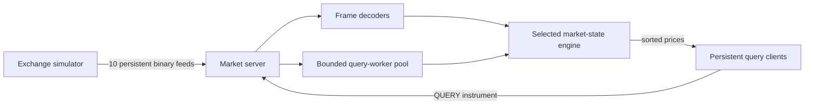

# ExchangeLab

ExchangeLab is a local C++20 market-data system built to explore TCP stream
processing, concurrent shared state, and performance measurement.

Ten simulated exchanges publish price updates for 50,000 instruments. A
continuously running server validates and stores the latest price from each
exchange, while persistent clients request cross-exchange prices sorted from
lowest to highest.

## Highlights

- Three independent processes: simulator, server, and interactive client.
- Fixed-size binary update frames over persistent TCP feeds.
- Buffered decoding for fragmented and combined TCP reads.
- Per-exchange sequence validation for duplicate, stale, gapped, and
  out-of-order updates.
- Dense storage for 500,000 exchange/instrument price entries.
- Selectable single-threaded, global-lock, and striped-lock runtimes.
- A bounded query-worker pool so overload produces `ERROR busy` instead of
  unbounded memory growth.
- Deterministic direct-engine and end-to-end TCP benchmarks.
- 47 automated unit and integration tests.

## Architecture



The repository builds four executables:

| Executable | Purpose |
|---|---|
| `exchange-simulator` | Generates deterministic or continuous exchange updates |
| `exchangelab-server` | Receives feeds and serves sorted-price queries |
| `exchangelab-client` | Provides an interactive persistent query connection |
| `exchangelab-benchmark` | Runs correctness-gated direct and TCP measurements |

## Runtime modes

The server selects its market-state strategy with `--mode`:

| Mode | Update and query execution |
|---|---|
| `single-threaded` | One Asio event-loop thread and the Phase 1 dense state |
| `global-read` | Ten feed threads and one reader-writer lock around the reference state |
| `striped-read` | Ten feed threads and 64 instrument-partitioned reader-writer locks |
| `striped-write` | The striped engine with ordered views maintained during updates |

The default remains `single-threaded`. This preserves a simple correctness
baseline and allows all modes to be compared through the same TCP protocol.

In striped mode, an instrument selects its lock with:

```text
stripe = instrument_id % stripe_count
```

Updates for instruments on different stripes can proceed concurrently. A
separate mutex per exchange protects that feed's sequence number, preserving
feed ordering even when consecutive messages update different instruments.

## Data and protocol integrity

TCP is a byte stream, not a message protocol. One read may contain part of a
frame, exactly one frame, or several frames. ExchangeLab buffers incoming bytes
until a complete 31-byte update frame is available.

```text
byte 0       protocol version
bytes 1-2    exchange ID
bytes 3-6    instrument ID
bytes 7-14   fixed-point price
bytes 15-22  sequence number
bytes 23-30  source timestamp
```

Every multi-byte field uses network byte order. The decoder rejects unsupported
versions, invalid IDs, non-positive prices, and sequence zero.

Sequence numbers are tracked per exchange rather than per instrument:

```text
new == last  -> duplicate, reject
new < last   -> stale/out of order, reject
new > last+1 -> accept and record the missing gap
otherwise    -> accept
```

Queries use a small line-based protocol:

```text
QUERY 1234
```

Successful responses are terminated by `END`, allowing a persistent client to
identify response boundaries:

```text
RESULT 1234
PRICE 2 $100.250000 sequence=42 source_ns=81000
PRICE 7 $100.270000 sequence=39 source_ns=79000
MISSING 0 1 3 4 5 6 8 9
END
```

## Build and test

Requirements:

- CMake 3.24 or newer
- A C++20 compiler such as Apple Clang, Clang, or GCC
- Internet access during the first configuration for pinned dependencies

```bash
cmake -S . -B build -DCMAKE_BUILD_TYPE=Debug
cmake --build build --parallel
ctest --test-dir build --output-on-failure
```

The suite contains 47 tests covering market-state rules, deterministic
simulation, encoding, fragmented and combined frames, all runtime modes,
concurrent equivalence, bounded queues, persistent clients, reconnects, active
shutdown, benchmark percentiles, CSV fields, and direct/TCP oracle checks.

### UndefinedBehaviorSanitizer

UBSan is an instrumented Debug build that detects many invalid C++ operations
while tests execute. It is separate from performance measurements.

```bash
cmake -S . -B build-ubsan \
  -DCMAKE_BUILD_TYPE=Debug \
  -DEXCHANGELAB_ENABLE_UNDEFINED_SANITIZER=ON
cmake --build build-ubsan --parallel
ctest --test-dir build-ubsan --output-on-failure
```

All 47 tests pass under UBSan on the documented development machine.

## Run the continuous system

Terminal 1 — start the server:

```bash
./build/exchangelab-server \
  --mode striped-read \
  --query-workers 4 \
  --query-queue 256 \
  --stripes 64
```

Terminal 2 — start ten feeds:

```bash
./build/exchange-simulator \
  --continuous \
  --rate 100000 \
  --seed 42 \
  --distribution uniform
```

Terminal 3 — connect an interactive client:

```bash
./build/exchangelab-client
```

At the client prompt, enter an instrument such as `1234`. The same connection
can issue repeated queries while prices continue changing. Use Ctrl+C to stop
the simulator and server cleanly.

## Benchmarks

Performance measurements must use an optimized Release build:

```bash
cmake -S . -B build-release -DCMAKE_BUILD_TYPE=Release
cmake --build build-release --parallel --target exchangelab-benchmark
./build-release/exchangelab-benchmark --help
```

The benchmark has two levels:

- **Direct engine:** calls updates and queries without TCP to isolate locking
  and sorting costs.
- **End-to-end TCP:** uses simulator-generated updates, 10 feed sockets, the
  real server, query pool, and persistent clients.

Each comparison uses identical seeds, dimensions, operation counts, ratios,
distributions, and query IDs. Workloads are prepared before timing. Warm-up
operations populate state and CPU caches before measurement, and every
published scenario uses five repetitions. The Phase 1 `MarketState` supplies
the correctness oracle.

The values below are medians from an Apple M2 Pro with 10 logical CPUs, Apple
Clang 17.0.0, seed 42, 10 exchanges, and 50,000 instruments:

| Level and workload | Mode | Updates/sec | Queries/sec | Query p50/p95/p99 |
|---|---|---:|---:|---:|
| TCP, 90/10 uniform, 16 clients | single-threaded | 501,676 | 55,742 | 191 / 824 / 2,269 us |
| Direct, 50/50 uniform | global-read | 867,842 | 867,842 | 0.209 / 12.417 / 52.541 us |
| Direct, 50/50 uniform | striped-read | 3,125,843 | 3,125,843 | 0.250 / 0.709 / 24.000 us |

The controlled measurements showed:

- Striped locking raised each separate direct-engine rate approximately 3.6×
  and reduced p99 about 54% relative to the global lock.
- The single-threaded engine remained faster overall for this small amount of
  work per operation; concurrency overhead is not free.
- Sort-on-read beat sort-on-write at every tested update/query ratio because a
  query sorts only 10 prices.
- Additional query workers increased direct throughput up to a point but made
  tail latency worse. One worker performed best in the complete TCP system on
  this 10-core machine.

See [the complete benchmark report](docs/benchmark-results.md) and the raw
per-repetition CSV files in `results/phase4/`. Results report updates and
queries separately and always include p99; combined operations/sec is not used
as the headline metric.

## Repository layout

```text
include/exchangelab/   Public C++ interfaces
src/                   Implementations and executable entry points
tests/                 GoogleTest unit and TCP integration tests
results/phase4/        Raw benchmark repetitions
docs/                  Concise design and benchmark documentation
```

## Scope and limitations

- Results describe one local machine and the documented workloads, not a
  universal capacity limit.
- This is a learning-focused local system, not a production exchange gateway.
- There is no authentication, encryption, persistence, or historical database.
- Prices remain available after a publisher disconnects.
- The project intentionally avoids lock-free structures, distributed systems,
  dashboards, plugins, and deployment infrastructure.

See [the design summary](docs/implementation-plan.md) for the decisions that
connect the four implementation phases.
