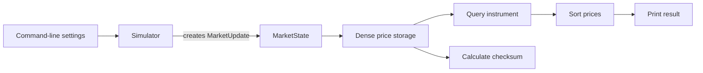

You’re right. My previous answer assumed you already understood the project vocabulary, then turned into a line-number index instead of actually teaching the code.

Let’s restart from absolute zero.

# 1. What ExchangeLab is

Imagine ten stores selling the same products.

- A **product** is an instrument, such as a stock.
- A **store** is an exchange.
- Each exchange continually announces a price for different instruments.
- ExchangeLab remembers the latest valid announcement from every exchange.
- A user can ask:

> What price does every exchange currently have for instrument 1234?

ExchangeLab then returns those prices from lowest to highest.

For example:

```text
Instrument 1234

Exchange 2: $100.25
Exchange 4: $100.27
Exchange 5: $100.29
```

Phase 1 does this entirely inside one program:



The major pieces are:

- `Simulator`: pretends to be the exchanges.
- `MarketUpdate`: one price message created by the simulator.
- `MarketState`: the program’s current memory of all prices.
- `QueryResult`: the answer for one requested instrument.
- `main.cpp`: connects everything and runs the program.
- Tests: automatically check that the rules work.

# 2. How C++ projects are divided into files

Our project has two main kinds of C++ files.

## Header files: `.hpp`

A header tells other files what exists.

For example:

```cpp
class MarketState {
public:
  ApplyResult apply(const MarketUpdate &update);
};
```

This says:

> There is a class named `MarketState`. It has an operation named `apply()`.

It does not contain all the instructions for how `apply()` works.

Think of a header as a restaurant menu. It tells you what can be ordered.

## Source files: `.cpp`

A source file contains the implementation:

```cpp
ApplyResult MarketState::apply(const MarketUpdate &update) {
  // Actual work happens here.
}
```

Think of this as the kitchen. It explains how the menu item is made.

Separating declarations and implementations helps because:

- Other code can understand how to use a class without reading all its internal logic.
- Large projects compile more efficiently.
- Public behavior stays separate from private details.

# 3. What CMake and the core library do

File: [CMakeLists.txt](/Users/kanisiva/Documents/Code/VSCode/Projects/ExchangeLab/CMakeLists.txt:1)

CMake is not a C++ compiler. It is a tool that organizes the build.

The process is:

```text
CMake reads CMakeLists.txt
        ↓
CMake creates build instructions
        ↓
Apple Clang compiles each .cpp file
        ↓
The linker combines compiled pieces
        ↓
We get runnable executables
```

## Declaring the project

```cmake
cmake_minimum_required(VERSION 3.24)

project(
    ExchangeLab
    VERSION 0.1.0
    DESCRIPTION "A local C++ market-data systems laboratory"
    LANGUAGES CXX
)
```

This tells CMake:

- CMake 3.24 or newer is required.
- The project is named `ExchangeLab`.
- Its current version is `0.1.0`.
- The project uses C++.
- CMake calls C++ `CXX`.

## Compiler warnings

```cmake
function(exchangelab_enable_warnings target_name)
    if(MSVC)
        target_compile_options(${target_name} PRIVATE /W4)
    else()
        target_compile_options(${target_name} PRIVATE -Wall -Wextra -Wpedantic)
    endif()
endfunction()
```

A compiler can find two categories of problems:

1. Errors that prevent compilation.
2. Suspicious code that can compile but might be wrong.

Warnings handle the second category.

This function enables a useful warning level:

- `/W4` for Microsoft’s compiler.
- `-Wall -Wextra -Wpedantic` for Clang and GCC.

`target_name` is whichever thing we are currently building.

## The core library

```cmake
add_library(exchangelab_core
    src/market_state.cpp
    src/simulator.cpp
)
```

This creates a target named `exchangelab_core`.

A **target** is something CMake knows how to build.

This target is a library containing:

- Market-state logic
- Simulator logic

A library is compiled code that is not directly runnable. It does not have `main()`.

Why make a library?

Because both of these need the same logic:

```text
Command-line program ──uses──┐
                             ├── exchangelab_core
Test program ─────────uses───┘
```

Without the library, we might compile duplicate copies of the same implementation or awkwardly mix production code with test code.

## Making headers visible

```cmake
target_include_directories(exchangelab_core
    PUBLIC
        ${CMAKE_CURRENT_SOURCE_DIR}/include
)
```

This tells the compiler where headers such as this live:

```cpp
#include "exchangelab/market_state.hpp"
```

`${CMAKE_CURRENT_SOURCE_DIR}` means the repository directory containing `CMakeLists.txt`.

Therefore:

```text
${CMAKE_CURRENT_SOURCE_DIR}/include
```

becomes:

```text
/Users/kanisiva/Documents/Code/VSCode/Projects/ExchangeLab/include
```

`PUBLIC` means:

- The core library needs this directory.
- Anything using the core library also needs it.

## Requiring C++20

```cmake
target_compile_features(exchangelab_core PUBLIC cxx_std_20)
exchangelab_enable_warnings(exchangelab_core)
```

The first line says the library requires C++20.

The second applies our warning settings.

## Building the executable

```cmake
add_executable(exchangelab src/main.cpp)
target_link_libraries(exchangelab PRIVATE exchangelab_core)
exchangelab_enable_warnings(exchangelab)
```

This creates the runnable program named `exchangelab`.

Its starting point is:

```text
src/main.cpp
```

It is linked with `exchangelab_core`, giving it access to the compiled simulator and market-state implementations.

The result is:

```text
build/exchangelab
```

## Building tests

```cmake
include(CTest)

if(BUILD_TESTING)
    find_package(GTest CONFIG QUIET)
```

CTest is CMake’s test runner.

GoogleTest is the C++ library we use to write individual tests.

CMake first checks whether GoogleTest is already installed.

If it is not installed, this section downloads a specific version:

```cmake
if(NOT GTest_FOUND)
    include(FetchContent)

    FetchContent_Declare(
        googletest
        URL https://github.com/google/googletest/archive/refs/tags/v1.15.2.zip
        DOWNLOAD_EXTRACT_TIMESTAMP TRUE
    )

    set(INSTALL_GTEST OFF CACHE BOOL "" FORCE)
    FetchContent_MakeAvailable(googletest)
endif()
```

Pinning version `1.15.2` means a future build will not unexpectedly download a different version with changed behavior.

The test executable is then created:

```cmake
add_executable(exchangelab_tests
    tests/market_state_test.cpp
    tests/simulator_test.cpp
)
```

It is connected to our project and GoogleTest:

```cmake
target_link_libraries(exchangelab_tests
    PRIVATE
        exchangelab_core
        GTest::gtest_main
)
```

`GTest::gtest_main` provides the test program’s `main()` function. We do not need to write another one ourselves.

Finally:

```cmake
include(GoogleTest)
gtest_discover_tests(exchangelab_tests)
```

This finds every test written with the `TEST(...)` macro and registers it with CTest.

# 4. Why `types.hpp` exists

File: [types.hpp](/Users/kanisiva/Documents/Code/VSCode/Projects/ExchangeLab/include/exchangelab/types.hpp:1)

Many parts of ExchangeLab need to agree on what an update, price, exchange ID, and query result look like.

Instead of redefining them separately, we put that shared vocabulary into one header.

Think of `types.hpp` as the project’s dictionary.

## Preventing duplicate inclusion

```cpp
#pragma once
```

C++ headers can be pulled into several files.

`#pragma once` tells the compiler:

> If you have already included this header while compiling the current source file, do not include it again.

## Importing standard-library tools

```cpp
#include <cstdint>
#include <vector>
```

`<cstdint>` supplies exact-size integer types.

`<vector>` supplies resizable arrays.

## The project namespace

```cpp
namespace exchangelab {
```

A namespace groups names together.

Without it, a different library could also define something named `MarketUpdate`, creating a conflict.

Inside this namespace, the full name is:

```cpp
exchangelab::MarketUpdate
```

## Giving integers meaningful names

```cpp
using ExchangeId = std::uint16_t;
using InstrumentId = std::uint32_t;
using Price = std::int64_t;
using SequenceNumber = std::uint64_t;
using TimestampNs = std::uint64_t;
```

Computers ultimately store these values as integers, but meaningful names tell us what each integer represents.

### `ExchangeId`

```cpp
using ExchangeId = std::uint16_t;
```

An unsigned 16-bit integer.

- “Unsigned” means it cannot be negative.
- It can hold values from 0 through 65,535.
- We only need IDs 0 through 9 by default.

### `InstrumentId`

```cpp
using InstrumentId = std::uint32_t;
```

An unsigned 32-bit integer.

It easily supports 50,000 instruments.

### `Price`

```cpp
using Price = std::int64_t;
```

A signed 64-bit integer.

“Signed” means it can represent positive and negative values, although market-state validation rejects non-positive prices.

### `SequenceNumber`

```cpp
using SequenceNumber = std::uint64_t;
```

A large unsigned integer representing a message’s position in an exchange feed.

### `TimestampNs`

```cpp
using TimestampNs = std::uint64_t;
```

A timestamp measured in nanoseconds.

## Fixed-point prices

```cpp
inline constexpr Price kPriceScale = 1'000'000;
```

Computers cannot represent every decimal fraction perfectly with normal floating-point numbers.

For example, a floating-point calculation can internally behave like:

```text
0.1 + 0.2 = 0.30000000000000004
```

That is inconvenient when prices must be compared exactly.

Instead, we scale prices by one million:

```text
$1.000000   → 1,000,000
$100.250000 → 100,250,000
$0.002500   → 2,500
```

`kPriceScale` stores that one-million multiplier.

`constexpr` means it is a permanent compile-time constant.

## A market update

```cpp
struct MarketUpdate {
  ExchangeId exchange_id{};
  InstrumentId instrument_id{};
  Price price{};
  SequenceNumber sequence{};
  TimestampNs source_timestamp_ns{};

  bool operator==(const MarketUpdate &) const = default;
};
```

A `struct` groups related values.

One `MarketUpdate` could mean:

```text
exchange_id        = 2
instrument_id      = 1234
price              = 100251500
sequence           = 93352
source_timestamp   = 933512000
```

In ordinary language:

> Exchange 2 says instrument 1234 now costs $100.251500. This was exchange 2’s message number 93,352.

The `{}` after each field gives it a safe zero default.

This line:

```cpp
bool operator==(const MarketUpdate &) const = default;
```

asks C++ to automatically create a way to compare two complete updates.

That lets a test say:

```cpp
EXPECT_EQ(actual_update, expected_update);
```

C++ will compare every field.

## Possible update outcomes

```cpp
enum class ApplyStatus {
  accepted,
  accepted_with_gap,
  duplicate,
  stale,
  invalid_exchange,
  invalid_instrument,
  invalid_price,
  invalid_sequence,
};
```

An enumeration represents a limited list of allowed choices.

An update cannot have some arbitrary textual status. It must have one of these values.

For example:

```cpp
ApplyStatus::accepted
ApplyStatus::duplicate
```

The meanings are:

- `accepted`: valid next update
- `accepted_with_gap`: valid newer update, but messages appear to be missing
- `duplicate`: same sequence as the last accepted update
- `stale`: sequence is older than the last accepted update
- `invalid_exchange`: exchange does not exist
- `invalid_instrument`: instrument does not exist
- `invalid_price`: price is zero or negative
- `invalid_sequence`: sequence is zero

## Result of applying an update

```cpp
struct ApplyResult {
  ApplyStatus status{};
  std::uint64_t missing_sequence_count{};
};
```

The status tells us what happened.

The second value gives additional information for a gap.

Suppose the last accepted sequence was 4 and the new sequence is 8:

```text
last sequence: 4
new sequence:  8

missing: 5, 6, 7
```

The result becomes:

```text
status = accepted_with_gap
missing_sequence_count = 3
```

## One price in a query result

```cpp
struct PriceView {
  ExchangeId exchange_id{};
  Price price{};
  SequenceNumber last_sequence{};
  TimestampNs source_timestamp_ns{};

  bool operator==(const PriceView &) const = default;
};
```

`PriceView` represents what one exchange currently says about one instrument.

This is outgoing information produced by a query.

`MarketUpdate` and `PriceView` look similar, but they serve different roles:

```text
MarketUpdate → incoming message
PriceView    → information returned to the user
```

## Complete query result

```cpp
struct QueryResult {
  InstrumentId instrument_id{};
  std::vector<PriceView> prices;
  std::vector<ExchangeId> missing_exchanges;

  bool operator==(const QueryResult &) const = default;
};
```

A query result contains:

- The requested instrument ID
- A list of known exchange prices
- A list of exchanges without a price

`std::vector` is a resizable array.

For example:

```text
prices:
  exchange 2 → $100.25
  exchange 4 → $100.27
  exchange 5 → $100.29

missing_exchanges:
  0, 1, 3, 6, 7, 8, 9
```

## Counters

```cpp
struct MarketStats {
  std::uint64_t received{};
  std::uint64_t accepted{};
  std::uint64_t duplicates{};
  std::uint64_t stale{};
  std::uint64_t gap_events{};
  std::uint64_t missing_sequences{};
  std::uint64_t invalid{};

  bool operator==(const MarketStats &) const = default;
};
```

These counters let us see what happened during a run.

There is an important difference between these two:

```text
gap_events
missing_sequences
```

If one update jumps from sequence 4 to sequence 8:

```text
gap_events = 1
missing_sequences = 3
```

# 5. What `MarketState` means

Files:

- [market_state.hpp](/Users/kanisiva/Documents/Code/VSCode/Projects/ExchangeLab/include/exchangelab/market_state.hpp:1)
- [market_state.cpp](/Users/kanisiva/Documents/Code/VSCode/Projects/ExchangeLab/src/market_state.cpp:1)

`MarketState` means:

> Everything ExchangeLab currently knows about market prices.

You can imagine it as a giant table:

```text
                    Exchange
Instrument      0       1       2       ...       9
----------------------------------------------------
0             price   price   price             price
1             price   price   price             price
2             price   price   price             price
...
49,999        price   price   price             price
```

There are:

```text
50,000 rows × 10 columns = 500,000 price slots
```

Each slot represents one instrument at one exchange.

## The public class declaration

```cpp
class MarketState {
public:
  MarketState(std::uint16_t exchange_count, std::uint32_t instrument_count);

  [[nodiscard]] ApplyResult apply(const MarketUpdate &update);

  [[nodiscard]] std::optional<QueryResult>
  query(InstrumentId instrument_id) const;

  [[nodiscard]] std::uint64_t logical_checksum() const;

  [[nodiscard]] std::uint16_t exchange_count() const noexcept;
  [[nodiscard]] std::uint32_t instrument_count() const noexcept;
  [[nodiscard]] const MarketStats &stats() const noexcept;
```

A `class` combines data with operations that control that data.

### Constructor

```cpp
MarketState(std::uint16_t exchange_count, std::uint32_t instrument_count);
```

A constructor runs when a `MarketState` object is created:

```cpp
MarketState state(10, 50'000);
```

That means:

> Create market storage for 10 exchanges and 50,000 instruments.

### `apply()`

```cpp
ApplyResult apply(const MarketUpdate &update);
```

This receives one update, checks it, and possibly changes stored state.

### `query()`

```cpp
std::optional<QueryResult> query(InstrumentId instrument_id) const;
```

This asks for the known prices for one instrument.

`std::optional` means the operation may return:

- A `QueryResult`
- Nothing

It returns nothing when the instrument ID is invalid.

The final `const` means querying promises not to change market state.

### `logical_checksum()`

```cpp
std::uint64_t logical_checksum() const;
```

A checksum is a compact fingerprint of data.

Imagine two enormous market-state tables. Comparing all 500,000 slots manually would be inconvenient.

Instead, each table can produce a number:

```text
State A → 0xc5b853573d929037
State B → 0xc5b853573d929037
```

Matching checksums give us strong evidence that both states contain the same logical values.

If one price changes:

```text
State A → 0xc5b853573d929037
State B → 0x751a9e822e83c614
```

This will become especially useful for replay:

```text
Live run checksum   = X
Replay checksum     = X
                       ↑
              same final state
```

It is not encryption and not a mathematical guarantee against deliberate attacks. It is a debugging and verification fingerprint.

### Accessors

```cpp
std::uint16_t exchange_count() const noexcept;
std::uint32_t instrument_count() const noexcept;
const MarketStats &stats() const noexcept;
```

These return information stored inside the object.

`noexcept` promises that these simple operations will not throw an exception.

## The private data

```cpp
private:
  struct PriceEntry {
    Price price{};
    SequenceNumber last_sequence{};
    TimestampNs source_timestamp_ns{};
    bool valid{};
  };
```

A `PriceEntry` is one cell in our logical table.

The `valid` field is necessary because a zero-filled cell does not automatically mean “the exchange has reported a price.”

At program startup:

```text
price = 0
sequence = 0
valid = false
```

After a valid update:

```text
price = 100251500
sequence = 25
valid = true
```

The rest of the private data is:

```cpp
std::uint16_t exchange_count_;
std::uint32_t instrument_count_;
std::vector<PriceEntry> entries_;
std::vector<SequenceNumber> last_sequences_;
MarketStats stats_;
```

- `exchange_count_`: number of exchanges
- `instrument_count_`: number of instruments
- `entries_`: all 500,000 price slots
- `last_sequences_`: one latest sequence per exchange
- `stats_`: counters

The trailing `_` is only a naming convention meaning:

> This variable belongs to the object.

# 6. How dense storage works

The class declares this helper:

```cpp
std::size_t entry_index(
    InstrumentId instrument_id,
    ExchangeId exchange_id) const noexcept;
```

Its implementation is:

```cpp
std::size_t MarketState::entry_index(
    const InstrumentId instrument_id,
    const ExchangeId exchange_id) const noexcept {
  return static_cast<std::size_t>(instrument_id) * exchange_count_ +
         exchange_id;
}
```

Although we imagine a two-dimensional table, the computer stores one long vector:

```text
Instrument 0, Exchange 0 → position 0
Instrument 0, Exchange 1 → position 1
Instrument 0, Exchange 2 → position 2
Instrument 1, Exchange 0 → position 3
Instrument 1, Exchange 1 → position 4
Instrument 1, Exchange 2 → position 5
```

For three exchanges:

```text
index = instrument × 3 + exchange
```

Instrument 1, exchange 2 becomes:

```text
index = 1 × 3 + 2
index = 5
```

For our normal ten exchanges:

```text
index = instrument × 10 + exchange
```

Instrument 1,234 at exchange 4 becomes:

```text
index = 1234 × 10 + 4
index = 12,344
```

This is faster and simpler than searching a map because the location is calculated directly.

# 7. Constructing market state

Before allocating memory, this helper validates the dimensions:

```cpp
std::size_t checked_entry_count(const std::uint16_t exchange_count,
                                const std::uint32_t instrument_count) {
  if (exchange_count == 0) {
    throw std::invalid_argument("exchange count must be greater than zero");
  }

  if (instrument_count == 0) {
    throw std::invalid_argument("instrument count must be greater than zero");
  }

  const auto exchanges = static_cast<std::size_t>(exchange_count);
  const auto instruments = static_cast<std::size_t>(instrument_count);

  if (instruments > std::numeric_limits<std::size_t>::max() / exchanges) {
    throw std::length_error("market-state dimensions are too large");
  }

  return instruments * exchanges;
}
```

`throw` stops the current operation and reports an error.

The multiplication check prevents integer overflow.

Integer overflow here could cause this:

```text
Requested entries:  enormous number
Calculated entries: accidentally wraps around to small number
```

The program might then allocate too little memory and later access outside it.

The constructor uses the checked result:

```cpp
MarketState::MarketState(const std::uint16_t exchange_count,
                         const std::uint32_t instrument_count)
    : exchange_count_(exchange_count),
      instrument_count_(instrument_count),
      entries_(checked_entry_count(exchange_count, instrument_count)),
      last_sequences_(exchange_count) {}
```

The section after `:` is called the initializer list.

It:

1. Saves the exchange count.
2. Saves the instrument count.
3. Creates the dense price vector.
4. Creates one sequence counter per exchange.

The `{}` at the end is an empty constructor body because initialization already did everything required.

# 8. Applying an update

This is the central write operation:

```cpp
ApplyResult MarketState::apply(const MarketUpdate &update) {
  ++stats_.received;

  if (update.exchange_id >= exchange_count_) {
    ++stats_.invalid;
    return {ApplyStatus::invalid_exchange, 0};
  }

  if (update.instrument_id >= instrument_count_) {
    ++stats_.invalid;
    return {ApplyStatus::invalid_instrument, 0};
  }

  if (update.price <= 0) {
    ++stats_.invalid;
    return {ApplyStatus::invalid_price, 0};
  }

  if (update.sequence == 0) {
    ++stats_.invalid;
    return {ApplyStatus::invalid_sequence, 0};
  }
```

The received counter is incremented first because every attempted update counts as received.

Each validation returns immediately when it fails. This is important because invalid data must never reach the mutation logic.

## Sequence checking

```cpp
auto &last_sequence = last_sequences_[update.exchange_id];

if (update.sequence == last_sequence) {
  ++stats_.duplicates;
  return {ApplyStatus::duplicate, 0};
}

if (update.sequence < last_sequence) {
  ++stats_.stale;
  return {ApplyStatus::stale, 0};
}
```

`auto&` means:

> Create another name for the original sequence value inside the vector.

It does not make a copy. Changing `last_sequence` changes the stored value.

Suppose exchange 0’s last accepted sequence is 10:

```text
New sequence 11 → accepted
New sequence 10 → duplicate
New sequence 9  → stale
New sequence 14 → accepted with gap
```

## Gap calculation

```cpp
const auto sequence_difference = update.sequence - last_sequence;

const auto missing_sequence_count =
    sequence_difference > 1 ? sequence_difference - 1 : 0;
```

The `? :` expression is a compact conditional:

```text
if difference is greater than 1:
    missing = difference - 1
otherwise:
    missing = 0
```

If the last sequence is 10 and the new one is 14:

```text
difference = 14 - 10 = 4
missing = 4 - 1 = 3
```

Messages 11, 12, and 13 are missing.

## Changing state

```cpp
last_sequence = update.sequence;

entries_[entry_index(update.instrument_id, update.exchange_id)] = PriceEntry{
    .price = update.price,
    .last_sequence = update.sequence,
    .source_timestamp_ns = update.source_timestamp_ns,
    .valid = true,
};
```

The first line advances that exchange’s accepted sequence.

The second section:

1. Calculates the correct dense index.
2. Finds that price slot.
3. Replaces it with the new values.
4. Marks it valid.

Finally:

```cpp
++stats_.accepted;

if (missing_sequence_count > 0) {
  ++stats_.gap_events;
  stats_.missing_sequences += missing_sequence_count;

  return {
      ApplyStatus::accepted_with_gap,
      missing_sequence_count,
  };
}

return {ApplyStatus::accepted, 0};
```

Every valid newer update increments `accepted`.

If a gap exists, the gap counters are also updated.

# 9. Querying an instrument

```cpp
std::optional<QueryResult>
MarketState::query(const InstrumentId instrument_id) const {
  if (instrument_id >= instrument_count_) {
    return std::nullopt;
  }
```

`std::nullopt` means:

> There is no result.

Next, we prepare an empty answer:

```cpp
QueryResult result;
result.instrument_id = instrument_id;
result.prices.reserve(exchange_count_);
result.missing_exchanges.reserve(exchange_count_);
```

`reserve()` prepares enough memory for up to ten values.

It does not add ten values. It only avoids repeated memory growth while values are added.

Then we inspect every exchange:

```cpp
for (ExchangeId exchange_id = 0;
     exchange_id < exchange_count_;
     ++exchange_id) {
  const auto &entry =
      entries_[entry_index(instrument_id, exchange_id)];

  if (entry.valid) {
    result.prices.push_back(PriceView{
        .exchange_id = exchange_id,
        .price = entry.price,
        .last_sequence = entry.last_sequence,
        .source_timestamp_ns = entry.source_timestamp_ns,
    });
  } else {
    result.missing_exchanges.push_back(exchange_id);
  }
}
```

A `for` loop has three important parts:

```cpp
for (starting value; continue condition; change after each loop)
```

Here:

```text
Start exchange_id at 0
Continue while it is below exchange_count
Increase it by one after each pass
```

For every exchange:

- If its slot is valid, copy it into `prices`.
- Otherwise, put its ID into `missing_exchanges`.

## Sorting the prices

```cpp
std::sort(
    result.prices.begin(),
    result.prices.end(),
    [](const PriceView &left, const PriceView &right) {
      if (left.price != right.price) {
        return left.price < right.price;
      }

      return left.exchange_id < right.exchange_id;
    });
```

`std::sort` needs:

1. Where the collection begins.
2. Where it ends.
3. A rule for deciding which of two values comes first.

The section beginning with `[]` is a small unnamed function called a lambda.

Its rule is:

```text
If prices differ:
    lower price comes first
Otherwise:
    lower exchange ID comes first
```

That second rule makes tied prices deterministic.

Finally:

```cpp
return result;
```

# 10. How the checksum works

The helper function is:

```cpp
void mix_checksum(std::uint64_t &hash, const std::uint64_t value) {
  constexpr std::uint64_t kFnvPrime = 1'099'511'628'211ULL;

  for (unsigned int byte = 0; byte < 8; ++byte) {
    hash ^= (value >> (byte * 8U)) & 0xffU;
    hash *= kFnvPrime;
  }
}
```

You do not need to memorize the bit operations.

Conceptually, it does this:

```text
current fingerprint
      +
next value
      ↓
new fingerprint
```

It processes a 64-bit value one byte at a time.

- `>>` moves a chosen byte into position.
- `& 0xff` isolates that byte.
- `^=` mixes the byte into the hash.
- Multiplication spreads the effect throughout the result.

The complete state checksum is:

```cpp
std::uint64_t MarketState::logical_checksum() const {
  constexpr std::uint64_t kFnvOffsetBasis =
      14'695'981'039'346'656'037ULL;

  auto hash = kFnvOffsetBasis;

  mix_checksum(hash, exchange_count_);
  mix_checksum(hash, instrument_count_);

  for (const auto sequence : last_sequences_) {
    mix_checksum(hash, sequence);
  }

  for (const auto &entry : entries_) {
    mix_checksum(hash, entry.valid ? 1U : 0U);

    if (entry.valid) {
      mix_checksum(hash, static_cast<std::uint64_t>(entry.price));
      mix_checksum(hash, entry.last_sequence);
      mix_checksum(hash, entry.source_timestamp_ns);
    }
  }

  return hash;
}
```

It mixes:

1. Market dimensions
2. Each exchange’s last sequence
3. Whether every price slot is valid
4. Every valid price
5. Its sequence
6. Its timestamp

Because it processes the entries in a fixed order, identical state produces an identical result.

# 11. What the simulator is

Files:

- [simulator.hpp](/Users/kanisiva/Documents/Code/VSCode/Projects/ExchangeLab/include/exchangelab/simulator.hpp:1)
- [simulator.cpp](/Users/kanisiva/Documents/Code/VSCode/Projects/ExchangeLab/src/simulator.cpp:1)

We do not have real exchanges sending data.

The simulator is a controlled fake data source. It lets us generate millions of updates without paying for a market-data feed.

Its configuration is:

```cpp
enum class TrafficDistribution {
  uniform,
  hot,
};

struct SimulatorConfig {
  std::uint16_t exchange_count{10};
  std::uint32_t instrument_count{50'000};
  std::uint64_t event_count{1'000'000};
  std::uint64_t seed{42};
  TrafficDistribution distribution{TrafficDistribution::uniform};
};
```

### Uniform traffic

All instruments are approximately equally likely.

### Hot traffic

Most traffic targets the first 1% of instruments.

That represents a market where a small set of popular instruments receives much more activity.

## Simulator’s internal data

```cpp
class Simulator {
public:
  explicit Simulator(SimulatorConfig config);

  [[nodiscard]] bool next(MarketUpdate &output);

private:
  [[nodiscard]] std::uint64_t random_bounded(
      std::uint64_t upper_bound);

  [[nodiscard]] InstrumentId next_instrument();

  SimulatorConfig config_;
  std::mt19937_64 random_;
  std::vector<SequenceNumber> sequences_;
  std::vector<Price> prices_;
  std::uint64_t generated_events_{};
};
```

The members are:

- `config_`: the settings
- `random_`: seeded random-number generator
- `sequences_`: next sequence state for every exchange
- `prices_`: simulated evolving prices
- `generated_events_`: number created so far

Why does the simulator have a separate price vector from `MarketState`?

Because they represent different things:

```text
Simulator prices  = what the fake exchanges believe
MarketState prices = what our receiving system accepted
```

Later, a dropped update may change the simulator’s price without changing market state.

# 12. Constructing the simulator

```cpp
Simulator::Simulator(SimulatorConfig config)
    : config_(config),
      random_(config.seed),
      sequences_(config.exchange_count),
      prices_(checked_entry_count(config)) {
```

This:

1. Saves the configuration.
2. starts the random generator with the seed.
3. creates one sequence counter per exchange.
4. creates one simulated price per dense slot.

Starting prices are initialized here:

```cpp
for (InstrumentId instrument_id = 0;
     instrument_id < config_.instrument_count;
     ++instrument_id) {
  for (ExchangeId exchange_id = 0;
       exchange_id < config_.exchange_count;
       ++exchange_id) {
    const auto index =
        static_cast<std::size_t>(instrument_id) *
            config_.exchange_count +
        exchange_id;

    prices_[index] =
        100 * kPriceScale +
        static_cast<Price>(instrument_id % 1'000) * 1'000 +
        static_cast<Price>(exchange_id) * 10'000;
  }
}
```

Every price starts around `$100`.

The instrument and exchange offsets prevent every slot from starting at exactly the same price.

These are fake prices for system testing, not realistic financial modeling.

# 13. Generating one simulated update

```cpp
bool Simulator::next(MarketUpdate &output) {
  if (generated_events_ >= config_.event_count) {
    return false;
  }
```

When enough events have been generated, `next()` returns `false`.

Otherwise, it selects an exchange:

```cpp
const auto exchange_id =
    static_cast<ExchangeId>(
        generated_events_ % config_.exchange_count);
```

For ten exchanges this produces:

```text
0, 1, 2, 3, 4, 5, 6, 7, 8, 9,
0, 1, 2, 3, ...
```

Then it selects an instrument and finds its price:

```cpp
const auto instrument_id = next_instrument();

const auto index =
    static_cast<std::size_t>(instrument_id) *
        config_.exchange_count +
    exchange_id;
```

The price moves slightly:

```cpp
constexpr Price kStepMicros = 2'500;

const auto step =
    static_cast<Price>(random_bounded(5)) - 2;

prices_[index] = std::clamp(
    prices_[index] + step * kStepMicros,
    1 * kPriceScale,
    1'000'000 * kPriceScale);
```

`random_bounded(5)` returns 0 through 4.

Subtracting 2 produces:

```text
-2, -1, 0, 1, 2
```

Multiplying by 2,500 micros produces:

```text
-$0.005000
-$0.002500
 no change
+$0.002500
+$0.005000
```

`std::clamp` prevents the price from falling below `$1` or exceeding `$1,000,000`.

Then the outgoing update is constructed:

```cpp
output = MarketUpdate{
    .exchange_id = exchange_id,
    .instrument_id = instrument_id,
    .price = prices_[index],
    .sequence = ++sequences_[exchange_id],
    .source_timestamp_ns = generated_events_ * 1'000,
};
```

The sequence is incremented separately for the selected exchange.

Finally:

```cpp
++generated_events_;
return true;
```

# 14. Selecting uniform or hot instruments

```cpp
std::uint64_t Simulator::random_bounded(
    const std::uint64_t upper_bound) {
  return random_() % upper_bound;
}
```

`random_()` produces a large pseudorandom integer.

`% upper_bound` calculates a remainder, forcing the result below the desired limit.

Instrument selection is:

```cpp
InstrumentId Simulator::next_instrument() {
  if (config_.distribution == TrafficDistribution::hot &&
      random_bounded(100) < 80) {
    const auto hot_instrument_count =
        std::max<std::uint32_t>(
            1,
            config_.instrument_count / 100);

    return static_cast<InstrumentId>(
        random_bounded(hot_instrument_count));
  }

  return static_cast<InstrumentId>(
      random_bounded(config_.instrument_count));
}
```

In hot mode:

- 80% of the time, select from the first 1% of instruments.
- Otherwise, select from the entire market.

In uniform mode, always select from the entire market.

# 15. What `main.cpp` does

File: [main.cpp](/Users/kanisiva/Documents/Code/VSCode/Projects/ExchangeLab/src/main.cpp:1)

`main()` is where the operating system begins running a C++ executable.

Everything else is a component. `main()` connects those components.

## Program options

```cpp
struct ProgramOptions {
  exchangelab::SimulatorConfig simulation;
  exchangelab::InstrumentId query_instrument{1'234};
  bool show_help{};
};
```

This groups all command-line choices.

The simulator settings have their own struct. The CLI adds:

- Which instrument should be queried
- Whether help should be printed

## Understanding `argc` and `argv`

The main function receives:

```cpp
int main(const int argc, char *argv[])
```

If you run:

```bash
./build/exchangelab --seed 42 --updates 1000
```

then the values approximately look like:

```text
argc = 5

argv[0] = "./build/exchangelab"
argv[1] = "--seed"
argv[2] = "42"
argv[3] = "--updates"
argv[4] = "1000"
```

The shell gives every argument to C++ as text.

## Converting text to integers

```cpp
std::uint64_t parse_unsigned(
    const std::string_view text,
    const std::string_view option) {
  std::uint64_t value{};

  const auto *begin = text.data();
  const auto *end = begin + text.size();

  const auto [position, error] =
      std::from_chars(begin, end, value);

  if (error != std::errc{} || position != end) {
    throw std::invalid_argument(
        std::string(option) +
        " requires a non-negative integer");
  }

  return value;
}
```

Command-line arguments arrive as text.

This converts text such as `"1000"` into the integer `1000`.

It rejects values such as:

```text
"hello"
"12cats"
"-50"
```

The second helper ensures a number fits into the target type:

```cpp
template <typename Target>
Target parse_bounded_unsigned(
    const std::string_view text,
    const std::string_view option) {
  const auto value = parse_unsigned(text, option);

  if (value > std::numeric_limits<Target>::max()) {
    throw std::invalid_argument(
        std::string(option) + " is too large");
  }

  return static_cast<Target>(value);
}
```

A template lets the same function work for different integer sizes.

For example:

```cpp
parse_bounded_unsigned<std::uint16_t>(...)
parse_bounded_unsigned<std::uint32_t>(...)
```

## Recognizing arguments

The central parser has this structure:

```cpp
for (int index = 1; index < argc; ++index) {
  const std::string_view option = argv[index];

  if (option == "--help") {
    options.show_help = true;
    continue;
  }

  if (index + 1 >= argc) {
    throw std::invalid_argument(
        std::string(option) + " requires a value");
  }

  const std::string_view value = argv[++index];

  if (option == "--seed") {
    options.simulation.seed = parse_unsigned(value, option);
  } else if (option == "--updates") {
    options.simulation.event_count =
        parse_unsigned(value, option);
  } else if (option == "--exchanges") {
    options.simulation.exchange_count =
        parse_bounded_unsigned<std::uint16_t>(
            value,
            option);
  } else if (option == "--instruments") {
    options.simulation.instrument_count =
        parse_bounded_unsigned<std::uint32_t>(
            value,
            option);
  } else if (option == "--query") {
    options.query_instrument =
        parse_bounded_unsigned<std::uint32_t>(
            value,
            option);
  } else if (option == "--distribution") {
    if (value == "uniform") {
      options.simulation.distribution =
          exchangelab::TrafficDistribution::uniform;
    } else if (value == "hot") {
      options.simulation.distribution =
          exchangelab::TrafficDistribution::hot;
    } else {
      throw std::invalid_argument(
          "--distribution must be uniform or hot");
    }
  } else {
    throw std::invalid_argument(
        "unknown option: " + std::string(option));
  }
}
```

This is a chain of questions:

```text
Is this --seed?
Otherwise, is it --updates?
Otherwise, is it --exchanges?
...
Otherwise, it is unknown.
```

After parsing:

```cpp
if (options.query_instrument >=
    options.simulation.instrument_count) {
  throw std::invalid_argument(
      "--query must be less than --instruments");
}
```

This prevents asking for an instrument that cannot exist.

## Formatting fixed-point prices

```cpp
void print_price(const exchangelab::Price price) {
  std::cout
      << '$'
      << price / exchangelab::kPriceScale
      << '.'
      << std::setfill('0')
      << std::setw(6)
      << price % exchangelab::kPriceScale
      << std::setfill(' ');
}
```

Suppose:

```text
price = 100251500
scale =   1000000
```

Integer division gives:

```text
100251500 / 1000000 = 100
```

The remainder gives:

```text
100251500 % 1000000 = 251500
```

The displayed result becomes:

```text
$100.251500
```

## The complete runtime connection

```cpp
int main(const int argc, char *argv[]) {
  try {
    const auto options = parse_options(argc, argv);

    if (options.show_help) {
      print_usage(argv[0]);
      return 0;
    }

    exchangelab::Simulator simulator(options.simulation);

    exchangelab::MarketState state(
        options.simulation.exchange_count,
        options.simulation.instrument_count);

    exchangelab::MarketUpdate update;

    while (simulator.next(update)) {
      [[maybe_unused]] const auto result =
          state.apply(update);
    }

    const auto query =
        state.query(options.query_instrument);

    if (!query.has_value()) {
      throw std::runtime_error(
          "query instrument is outside market-state range");
    }

    print_result(options, state, *query);
    return 0;
  } catch (const std::exception &error) {
    std::cerr << "error: " << error.what() << '\n';
    return 1;
  }
}
```

In plain English:

```text
1. Read the command-line settings.
2. Print help and stop if requested.
3. Create the simulator.
4. Create empty market state.
5. Repeatedly generate one update.
6. Apply that update.
7. Stop when the simulator runs out.
8. Query the requested instrument.
9. Print prices, counters, and checksum.
10. If anything fails, print an error.
```

Returning `0` from `main()` means success.

Returning `1` means failure.

# 16. What the tests are doing

Files:

- [market_state_test.cpp](/Users/kanisiva/Documents/Code/VSCode/Projects/ExchangeLab/tests/market_state_test.cpp:1)
- [simulator_test.cpp](/Users/kanisiva/Documents/Code/VSCode/Projects/ExchangeLab/tests/simulator_test.cpp:1)

A test follows this general pattern:

```cpp
TEST(MarketStateTest, CountsAndAcceptsSequenceGaps) {
  MarketState state(1, 2);

  const auto result =
      state.apply(update(0, 1, 100 * kPriceScale, 4));

  EXPECT_EQ(
      result.status,
      ApplyStatus::accepted_with_gap);

  EXPECT_EQ(result.missing_sequence_count, 3U);
}
```

It has three parts:

1. Arrange: create starting objects.
2. Act: perform the operation.
3. Assert: check the result.

`EXPECT_EQ` means:

> Fail this test if the two values are not equal.

`ASSERT_TRUE` means:

> This condition must be true. If it is false, stop the current test immediately.

## Market-state tests

The market tests verify:

```text
RejectsZeroDimensions
```

A market cannot have zero exchanges or instruments.

```text
AcceptsUpdateAndReturnsItFromQuery
```

A valid update appears in a later query.

```text
TracksSequenceAcrossAllInstrumentsForAnExchange
```

Sequence numbers belong to the exchange feed, even when messages concern different instruments.

```text
CountsAndAcceptsSequenceGaps
```

A newer update with missing intermediate messages is accepted and counted.

```text
InvalidUpdatesDoNotAdvanceSequenceOrChangePrices
```

Bad input cannot secretly mutate state.

```text
SortsByPriceThenExchangeIdAndReportsMissingExchanges
```

Prices and ties are ordered correctly.

```text
RejectsOutOfRangeQuery
```

A nonexistent instrument produces no result.

```text
ChecksumTracksLogicalStateDeterministically
```

Equal states have equal fingerprints; different states have different fingerprints in the tested case.

## Simulator tests

This is the known-seed test:

```cpp
TEST(SimulatorTest, KnownSeedProducesExpectedUpdates) {
  Simulator simulator(SimulatorConfig{
      .exchange_count = 2,
      .instrument_count = 10,
      .event_count = 3,
      .seed = 42,
      .distribution = TrafficDistribution::uniform,
  });

  const std::vector<MarketUpdate> expected{
      MarketUpdate{0, 6, 100'011'000, 1, 0},
      MarketUpdate{1, 0, 100'010'000, 1, 1'000},
      MarketUpdate{0, 1, 100'003'500, 2, 2'000},
  };

  for (const auto &expected_update : expected) {
    MarketUpdate actual;
    ASSERT_TRUE(simulator.next(actual));
    EXPECT_EQ(actual, expected_update);
  }

  MarketUpdate exhausted;
  EXPECT_FALSE(simulator.next(exhausted));
}
```

This pins the first three updates produced by seed 42.

If simulator behavior changes unexpectedly, the test fails and shows exactly where.

The other simulator tests verify:

- Invalid configurations are rejected.
- Two simulators with the same seed produce the same stream.
- Hot traffic really concentrates on 1% of instruments.
- Two full one-million-update runs produce matching counters and checksums.

# 17. What happens when you build the project

When you run:

```bash
cmake -S . -B build -DCMAKE_BUILD_TYPE=Debug
```

CMake:

1. Reads `CMakeLists.txt`.
2. Finds Apple Clang.
3. Finds or downloads GoogleTest.
4. Generates build instructions inside `build/`.

When you run:

```bash
cmake --build build --parallel
```

the compiler approximately does this:

```text
market_state.cpp → market_state.cpp.o
simulator.cpp    → simulator.cpp.o
```

Those object files are combined into:

```text
libexchangelab_core.a
```

Then:

```text
main.cpp.o + libexchangelab_core.a
              ↓
       build/exchangelab
```

The test files are similarly combined into:

```text
build/exchangelab_tests
```

Finally:

```bash
ctest --test-dir build --output-on-failure
```

runs all 13 tests.

# 18. The complete project flow in ordinary language

When you launch ExchangeLab:

```text
The operating system starts main().
```

`main()` reads your settings:

```text
10 exchanges
50,000 instruments
1,000,000 updates
seed 42
query instrument 1234
```

It creates a `Simulator`.

The simulator creates an update:

```text
Exchange 0
Instrument 406
Price $100.411000
Sequence 1
Timestamp 0
```

`main()` gives it to `MarketState::apply()`.

`apply()` checks:

```text
Does exchange 0 exist? Yes.
Does instrument 406 exist? Yes.
Is the price positive? Yes.
Is the sequence valid and newer? Yes.
```

It calculates the storage location:

```text
406 × 10 + 0 = 4,060
```

It stores the update in vector position 4,060.

This repeats one million times.

Then `main()` requests instrument 1,234.

`MarketState::query()` checks ten slots:

```text
instrument 1234 / exchange 0
instrument 1234 / exchange 1
...
instrument 1234 / exchange 9
```

It separates known and missing entries, sorts the known prices, and returns them.

Finally, `main()` prints:

- Configuration
- Sorted prices
- Missing exchanges
- Counters
- State checksum

That is the entire Phase 1 system.
