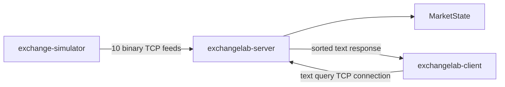

Phase 2 is complete, but owning the code means understanding much more than
knowing which commands to run.

Let’s restart from absolute zero and build the whole picture carefully.

# 1. What ExchangeLab is now

Imagine ten stores selling the same products.

- A **product** is an instrument, such as a stock.
- A **store** is an exchange.
- Each exchange continually announces prices for different instruments.
- ExchangeLab remembers the latest valid announcement from every exchange.
- A user can ask what every exchange currently says about one instrument.

Phase 1 performed all of that work inside one program:

```text
Simulator → MarketState → Query → Printed result
```

Phase 2 turns it into a small networked system made of three separately
running programs:



The three programs are:

- `exchange-simulator`: pretends to be ten exchanges and publishes updates.
- `exchangelab-server`: receives updates, owns `MarketState`, and answers
  queries.
- `exchangelab-client`: lets a person repeatedly request instruments from a
  terminal.

The server stays active until you press Ctrl+C. The simulator can either send
a fixed number of updates or continue until Ctrl+C. The client keeps asking
for commands until you type `quit`.

That is a fundamentally different shape from Phase 1:

```text
Phase 1:
one executable
one process
direct function calls
one beginning and one end

Phase 2:
three executables
three processes
TCP communication
programs can start and stop independently
```

# 2. Why three separate processes matter

A **program** is a file containing executable instructions.

Examples are:

```text
build/exchangelab-server
build/exchange-simulator
build/exchangelab-client
```

A **process** is one running instance of a program.

When you run this command:

```bash
./build/exchangelab-server
```

the operating system creates a server process.

If another terminal runs:

```bash
./build/exchange-simulator --continuous
```

the operating system creates a different process.

Each process has its own memory.

That means the simulator cannot do this:

```cpp
server.market_state.apply(update);
```

The simulator has no access to the server’s `MarketState` object. That object
exists only in the server process.

Instead, the simulator must turn an update into bytes and ask the operating
system to deliver those bytes:

```text
Simulator's MarketUpdate
        ↓
31 encoded bytes
        ↓
simulator socket
        ↓
operating-system TCP implementation
        ↓
server socket
        ↓
decoded MarketUpdate
        ↓
server's MarketState
```

This process separation is valuable because it resembles a real service:

- The server can keep running when a client exits.
- A new client can connect later.
- A publisher can disconnect and reconnect.
- A bad client request cannot directly access the server’s C++ objects.
- Communication has an explicit, testable protocol.

# 3. Processes, threads, sockets, connections, addresses, and ports

These words refer to different pieces of the system.

## Process

A process is a running program with its own memory and operating-system
resources.

Phase 2 normally has three:

```text
Process 1: exchangelab-server
Process 2: exchange-simulator
Process 3: exchangelab-client
```

## Thread

A thread is one path of execution inside a process.

A process can have one thread or many threads.

In Phase 2, the production programs deliberately remain simple:

```text
server:    one Asio event-loop thread
simulator: one Asio event-loop thread
client:    one terminal/client thread
```

Ten feed connections do not mean ten threads. One event-loop thread can watch
many sockets.

Actual multithreaded market-state access belongs to Phase 3.

## IP address

An IP address identifies a network location.

ExchangeLab uses:

```text
127.0.0.1
```

This is the IPv4 **loopback address**, usually called localhost.

Traffic sent to this address stays on the same computer. It still passes
through the operating system’s TCP implementation, but it does not travel
through a physical router or across the internet.

## Port

A port identifies a particular network service at an address.

The default server endpoints are:

```text
127.0.0.1:9000 → binary exchange updates
127.0.0.1:9001 → text queries
```

The address identifies the computer. The port identifies which part of the
server the connection wants.

An analogy is:

```text
IP address → apartment building address
port       → apartment number
```

## Socket

A socket is an operating-system object used by a program to communicate over
a network.

The simulator owns ten connected feed sockets. The client owns one connected
query socket. The server owns:

- One listening feed socket.
- One listening query socket.
- One accepted socket for every connected feed.
- One accepted socket for every connected query client.

## Connection

A TCP connection joins one socket on the client side to one socket on the
server side:

```text
simulator feed socket ←──── TCP connection ────→ server feed socket
```

The simulator opens ten connections because each connection represents one
logical exchange feed.

## Acceptor

The server-side object that listens for new TCP connections is called an
acceptor.

The server has two acceptors:

```text
feed_acceptor  → port 9000
query_acceptor → port 9001
```

An acceptor is not the socket used to exchange all later data. It creates a
new connected socket for each accepted peer.

# 4. What TCP guarantees and what it does not

TCP gives each connection an ordered stream of bytes.

If a healthy connection sends these bytes:

```text
01 02 03 04 05
```

the receiving application sees them in that order.

TCP also handles packet loss, retransmission, and duplicate network packets
below our application. ExchangeLab does not implement those mechanisms.

But TCP does not know what a `MarketUpdate` is.

Suppose the simulator writes two 31-byte messages:

```text
[31 bytes for update A][31 bytes for update B]
```

The server is not guaranteed to receive two 31-byte reads.

It could receive:

```text
read 1: 12 bytes
read 2: 19 bytes
read 3: 31 bytes
```

Or:

```text
read 1: 62 bytes
```

Or:

```text
read 1: 40 bytes
read 2: 22 bytes
```

All three are valid TCP behavior.

This is the key rule:

> One write is not guaranteed to equal one read.

TCP preserves byte order within one connection, but it does not define one
global order across ten different connections.

For example, exchange 7’s update may be processed before exchange 2’s update
even if the simulator started exchange 2’s write first.

That is safe because ExchangeLab tracks sequence numbers independently per
exchange.

# 5. Synchronous and asynchronous operations

A **synchronous** operation waits where it is called.

Conceptually:

```text
Call read()
    ↓
Stop here until bytes arrive
    ↓
Return the bytes
```

An **asynchronous** operation starts work and returns immediately.

Conceptually:

```text
Call async_read(..., callback)
    ↓
Return immediately
    ↓
Operating system waits for data
    ↓
Event loop invokes callback later
```

A callback is simply a function saved for later execution.

The server needs asynchronous operations because it must watch many things:

- New feed connections.
- New query connections.
- Bytes arriving from every feed.
- Query commands arriving from every client.
- Completed response writes.
- Ctrl+C.

If the server used a blocking read on one idle client, it could stop noticing
all the active exchange feeds.

## The event loop

Asio’s `io_context` is the event loop.

The general pattern is:

```cpp
asio::io_context event_loop;

start_some_asynchronous_operations();

event_loop.run();
```

`run()` waits for operations to complete and invokes their callbacks.

The callbacks usually start the next asynchronous operation:

```text
async read completes
        ↓
read callback processes bytes
        ↓
callback starts another async read
```

That produces a continuously running connection without a `while` loop that
blocks the whole server.

## Concurrency without parallel execution

Many Phase 2 socket operations can be waiting at the same time. That is
concurrency.

Only one server thread calls `event_loop.run()`, so only one callback executes
at a time. That means the callbacks are not parallel.

```text
update callback runs completely
        ↓
query callback runs completely
        ↓
another update callback runs completely
```

This is why the existing single-threaded `MarketState` remains safe in Phase
2 without a mutex.

# 6. How the Phase 2 build is organized

File: [CMakeLists.txt](/Users/kanisiva/Documents/Code/VSCode/Projects/ExchangeLab/CMakeLists.txt:1)

Phase 1 already had a core library:

```cmake
add_library(exchangelab_core
    src/market_state.cpp
    src/simulator.cpp
)
```

That library still contains the logical market behavior:

```text
MarketState
Simulator
shared domain types
```

We did not add sockets to `MarketState`. The market engine should not need to
know whether an update came from TCP, a unit test, or a future benchmark.

## Adding Standalone Asio

Phase 2 adds the Asio networking library:

```cmake
include(FetchContent)

FetchContent_Declare(
    asio
    URL https://github.com/chriskohlhoff/asio/archive/refs/tags/asio-1-38-2.tar.gz
    DOWNLOAD_EXTRACT_TIMESTAMP TRUE
)

FetchContent_MakeAvailable(asio)
```

`FetchContent` downloads a dependency while CMake configures the project.

The exact version is pinned to `1.38.2`. Pinning means a future build does not
silently obtain an incompatible new version.

Asio is header-based, so we create an interface target:

```cmake
find_package(Threads REQUIRED)

add_library(exchangelab_asio INTERFACE)

target_include_directories(exchangelab_asio
    INTERFACE
        ${asio_SOURCE_DIR}/include
)

target_compile_definitions(
    exchangelab_asio
    INTERFACE
    ASIO_STANDALONE
)

target_link_libraries(
    exchangelab_asio
    INTERFACE
    Threads::Threads
)
```

An `INTERFACE` target does not compile its own `.cpp` file. It carries build
requirements to targets that use it.

`ASIO_STANDALONE` tells Asio that we are using it without the larger Boost
library.

## The networking library

```cmake
add_library(exchangelab_network
    src/exchange_publisher.cpp
    src/market_server.cpp
    src/query_client.cpp
    src/query_protocol.cpp
    src/update_codec.cpp
    src/update_stream_decoder.cpp
)
```

This library contains everything shared by networking executables and tests.

It depends on both the core and Asio:

```cmake
target_link_libraries(exchangelab_network
    PUBLIC
        exchangelab_core
        exchangelab_asio
)
```

The dependency direction is:

```text
exchangelab_network
        ├── uses exchangelab_core
        └── uses exchangelab_asio
```

The core does not depend on the network layer.

## The three executables

```cmake
add_executable(exchangelab-server src/server_main.cpp)
target_link_libraries(exchangelab-server PRIVATE exchangelab_network)

add_executable(exchange-simulator src/exchange_simulator_main.cpp)
target_link_libraries(exchange-simulator PRIVATE exchangelab_network)

add_executable(exchangelab-client src/client_main.cpp)
target_link_libraries(exchangelab-client PRIVATE exchangelab_network)
```

Each executable has its own `main()` function.

The old Phase 1 `src/main.cpp` was removed because there is no longer one
program that owns simulation, market state, and printing together.

## The expanded test executable

```cmake
add_executable(exchangelab_tests
    tests/market_state_test.cpp
    tests/query_protocol_test.cpp
    tests/simulator_test.cpp
    tests/tcp_system_test.cpp
    tests/update_codec_test.cpp
    tests/update_stream_decoder_test.cpp
)
```

The tests link the networking library, which already brings in the core:

```cmake
target_link_libraries(exchangelab_tests
    PRIVATE
        exchangelab_network
        GTest::gtest_main
)
```

The resulting target graph is:

```text
exchangelab_core
       ↑
exchangelab_network ← exchangelab_asio
       ↑
       ├── exchangelab-server
       ├── exchange-simulator
       ├── exchangelab-client
       └── exchangelab_tests
```

# 7. Why network messages need a protocol

Two separate processes cannot exchange a C++ object directly.

The simulator has a `MarketUpdate` object:

```cpp
MarketUpdate{
    .exchange_id = 3,
    .instrument_id = 1234,
    .price = 300'000'000,
    .sequence = 8'000'000,
    .source_timestamp_ns = 1'789'123'082'330'580'000,
}
```

The socket can only send bytes.

We therefore need an agreement answering these questions:

- Which field comes first?
- How many bytes does each field use?
- How are integers ordered within those bytes?
- How does the receiver know a whole message is available?
- Which values are invalid?

That agreement is a **protocol**.

Phase 2 has two protocols:

```text
Binary update protocol → simulator to server
Text query protocol     → client to server and back
```

The update path uses binary because its shape is fixed and frequent.

The query path uses text because a person should be able to read it easily.

# 8. The binary update protocol declaration

Files:

- [update_codec.hpp](/Users/kanisiva/Documents/Code/VSCode/Projects/ExchangeLab/include/exchangelab/update_codec.hpp:1)
- [update_codec.cpp](/Users/kanisiva/Documents/Code/VSCode/Projects/ExchangeLab/src/update_codec.cpp:1)

The header documents the exact layout:

```cpp
// Version 1 update frame, with no compiler padding:
//   byte 0       protocol version
//   bytes 1-2    exchange ID
//   bytes 3-6    instrument ID
//   bytes 7-14   positive fixed-point price in micros
//   bytes 15-22  sequence number
//   bytes 23-30  source timestamp in nanoseconds
// Every multi-byte field is stored most-significant byte first (network order).
```

The actual constants are:

```cpp
inline constexpr std::uint8_t kUpdateProtocolVersion = 1;
inline constexpr std::size_t kUpdateFrameSize = 31;
```

The six fields consume:

```text
version       1 byte
exchange      2 bytes
instrument    4 bytes
price         8 bytes
sequence      8 bytes
timestamp     8 bytes
             --------
total        31 bytes
```

## What a byte is

A bit is one binary digit:

```text
0 or 1
```

A byte contains eight bits:

```text
10101100
```

One byte can represent 256 possible patterns, from 0 through 255.

Hexadecimal is a compact way of writing bytes. One byte can be written with
two hexadecimal digits:

```text
decimal 0   → hex 00
decimal 1   → hex 01
decimal 255 → hex FF
```

## Why the protocol has a version

The first byte is:

```text
01
```

That means protocol version 1.

If the receiver sees version 2, it does not guess. It rejects the frame.

This project does not build a general version-negotiation framework. The one
byte simply prevents unknown layouts from being misinterpreted as version 1.

## Why the frame is fixed-size

Every update contains the same fields, so every update is exactly 31 bytes.

That gives the stream decoder a simple rule:

```text
fewer than 31 buffered bytes → wait
at least 31 buffered bytes   → decode one frame
```

There is no length field because the length never changes.

## Why we do not transmit a raw C++ struct

It might be tempting to send this object’s memory:

```cpp
socket.send(&update, sizeof(update));
```

We deliberately do not do that.

A compiler may insert unused padding bytes between fields. Different machines
may arrange multi-byte numbers differently. A future compiler could lay the
object out differently.

For example, a compiler might represent the logical fields like this in local
memory:

```text
exchange [padding] instrument [padding] price sequence timestamp
```

The network protocol instead has a stable layout independent of compiler
decisions.

## The frame type

```cpp
using UpdateFrame =
    std::array<std::uint8_t, kUpdateFrameSize>;
```

`std::array` is a fixed-size collection.

An `UpdateFrame` always contains exactly 31 bytes. It cannot accidentally grow
or shrink.

## Runtime limits

```cpp
struct UpdateLimits {
  std::uint16_t exchange_count{};
  std::uint32_t instrument_count{};
};
```

The byte format can represent many exchange and instrument IDs. A particular
server may be configured for only:

```text
10 exchanges
50,000 instruments
```

`UpdateLimits` lets decoding reject values outside that configured market.

## Decode outcomes

```cpp
enum class UpdateDecodeError {
  none,
  wrong_size,
  unsupported_version,
  invalid_exchange,
  invalid_instrument,
  invalid_price,
  invalid_sequence,
};
```

An enumeration limits the error to a known set of possibilities.

The complete result is:

```cpp
struct UpdateDecodeResult {
  std::optional<MarketUpdate> update;
  UpdateDecodeError error{UpdateDecodeError::none};
};
```

On success:

```text
update = decoded MarketUpdate
error  = none
```

On failure:

```text
update = no value
error  = the specific reason
```

`std::optional` makes it impossible to pretend that a failed decode produced
a valid update.

# 9. Network byte order

An integer larger than one byte must be broken into several bytes.

Consider the hexadecimal value:

```text
0x1234
```

It needs two bytes:

```text
12 34
```

Some processors store the least-significant byte first in local memory. Others
may store the most-significant byte first.

Network protocols use a consistent convention called **network byte order**:

> Store the most-significant byte first.

This is also called big-endian order.

ExchangeLab encodes every multi-byte field explicitly, even though the
simulator and server currently run on the same machine. That makes the
protocol itself correct rather than accidentally relying on one processor.

# 10. Encoding one integer into bytes

The private helper is:

```cpp
template <typename Unsigned>
void write_unsigned(
    UpdateFrame &frame,
    std::size_t offset,
    Unsigned value) {
  for (std::size_t index = 0;
       index < sizeof(Unsigned);
       ++index) {
    const auto shift =
        (sizeof(Unsigned) - index - 1U) * 8U;

    frame[offset + index] =
        static_cast<std::uint8_t>(
            (value >> shift) & 0xffU);
  }
}
```

This is a function template.

A template lets the same logic encode different unsigned integer types:

```text
16-bit exchange ID
32-bit instrument ID
64-bit sequence
64-bit timestamp
```

## `sizeof`

`sizeof(Unsigned)` asks how many bytes the chosen integer type occupies.

Examples:

```text
uint16_t → 2 bytes
uint32_t → 4 bytes
uint64_t → 8 bytes
```

## Shifting bits

The operator `>>` shifts bits to the right.

The expression:

```cpp
(value >> shift) & 0xffU
```

does two things:

1. Moves the desired byte to the lowest position.
2. Uses `& 0xff` to keep only that byte.

For `0x1234`:

```text
first loop:
  shift right 8 bits
  result 0x12

second loop:
  shift right 0 bits
  result 0x34
```

The bytes are written as:

```text
12 34
```

## Encoding a complete update

```cpp
UpdateFrame encode_update(const MarketUpdate &update) {
  UpdateFrame frame{};

  frame[0] = kUpdateProtocolVersion;
  write_unsigned(frame, 1, update.exchange_id);
  write_unsigned(frame, 3, update.instrument_id);
  write_unsigned(
      frame,
      7,
      static_cast<std::uint64_t>(update.price));
  write_unsigned(frame, 15, update.sequence);
  write_unsigned(frame, 23, update.source_timestamp_ns);

  return frame;
}
```

The numeric offsets match the documented layout:

```text
frame[0]         → version
starting at 1    → exchange
starting at 3    → instrument
starting at 7    → price
starting at 15   → sequence
starting at 23   → timestamp
```

`static_cast<std::uint64_t>` explicitly converts the signed `Price` storage
type into the unsigned form used by the generic byte writer.

Valid network prices are positive. Decoding rejects zero, negative bit
patterns, and values too large for `Price`.

# 11. Reconstructing integers from bytes

The inverse helper is:

```cpp
template <typename Unsigned>
Unsigned read_unsigned(
    std::span<const std::uint8_t> frame,
    std::size_t offset) {
  Unsigned value{};

  for (std::size_t index = 0;
       index < sizeof(Unsigned);
       ++index) {
    value = static_cast<Unsigned>(
        (value << 8U) | frame[offset + index]);
  }

  return value;
}
```

`std::span` is a non-owning view of consecutive values.

It does not copy the 31 bytes. It says:

> Look at this existing sequence of bytes for this operation.

The decoder starts with zero. For bytes `12 34`:

```text
start:       value = 0x0000
read 12:     value = 0x0012
shift left:  value = 0x1200
read 34:     value = 0x1234
```

The `|` operator combines the new byte with the shifted accumulated value.

# 12. Decoding and validating one frame

The decoder first checks the frame boundary:

```cpp
if (frame.size() != kUpdateFrameSize) {
  return {.error = UpdateDecodeError::wrong_size};
}
```

Then the protocol version:

```cpp
if (frame[0] != kUpdateProtocolVersion) {
  return {
      .error = UpdateDecodeError::unsupported_version,
  };
}
```

Only then does it reconstruct each value:

```cpp
const auto exchange_id =
    read_unsigned<ExchangeId>(frame, 1);

const auto instrument_id =
    read_unsigned<InstrumentId>(frame, 3);

const auto encoded_price =
    read_unsigned<std::uint64_t>(frame, 7);

const auto sequence =
    read_unsigned<SequenceNumber>(frame, 15);

const auto source_timestamp_ns =
    read_unsigned<TimestampNs>(frame, 23);
```

The server’s configured dimensions are enforced next:

```cpp
if (exchange_id >= limits.exchange_count) {
  return {.error = UpdateDecodeError::invalid_exchange};
}

if (instrument_id >= limits.instrument_count) {
  return {.error = UpdateDecodeError::invalid_instrument};
}
```

The price must fit into the signed `Price` type and must be positive:

```cpp
if (encoded_price == 0 ||
    encoded_price >
        static_cast<std::uint64_t>(
            std::numeric_limits<Price>::max())) {
  return {.error = UpdateDecodeError::invalid_price};
}
```

Sequence zero is invalid:

```cpp
if (sequence == 0) {
  return {.error = UpdateDecodeError::invalid_sequence};
}
```

Finally, a valid C++ object is constructed:

```cpp
return {
    .update = MarketUpdate{
        .exchange_id = exchange_id,
        .instrument_id = instrument_id,
        .price = static_cast<Price>(encoded_price),
        .sequence = sequence,
        .source_timestamp_ns = source_timestamp_ns,
    },
    .error = UpdateDecodeError::none,
};
```

An important boundary exists here:

```text
malformed network frame
        ↓
rejected by decoder
        ↓
MarketState::apply() is never called
```

A duplicate or stale update is different. Its bytes and fields are valid, so
it reaches `MarketState`, which applies the Phase 1 sequence rules.

# 13. The TCP update stream decoder

Files:

- [update_stream_decoder.hpp](/Users/kanisiva/Documents/Code/VSCode/Projects/ExchangeLab/include/exchangelab/update_stream_decoder.hpp:1)
- [update_stream_decoder.cpp](/Users/kanisiva/Documents/Code/VSCode/Projects/ExchangeLab/src/update_stream_decoder.cpp:1)

The update codec understands exactly one complete 31-byte frame.

The stream decoder solves a different problem:

> How do we find complete 31-byte frames inside arbitrary chunks returned by
> TCP reads?

Its output groups successful updates and failures:

```cpp
struct UpdateDecodeBatch {
  std::vector<MarketUpdate> updates;
  std::vector<UpdateDecodeError> errors;
};
```

One TCP read can contain several frames, so the result can contain several
updates.

One read can also contain an invalid frame followed by a valid frame. The
errors and valid updates are therefore collected separately.

## The decoder’s state

```cpp
class UpdateStreamDecoder {
public:
  explicit UpdateStreamDecoder(UpdateLimits limits);

  UpdateDecodeBatch append(
      std::span<const std::uint8_t> bytes);

  std::size_t buffered_byte_count() const noexcept;
  bool finish();

private:
  UpdateLimits limits_;
  std::vector<std::uint8_t> buffered_bytes_;
};
```

`limits_` remembers the configured exchange and instrument ranges.

`buffered_bytes_` owns any bytes that have arrived but have not yet formed a
complete frame.

## Reserving a small amount of space

```cpp
UpdateStreamDecoder::UpdateStreamDecoder(
    const UpdateLimits limits)
    : limits_(limits) {
  buffered_bytes_.reserve(kUpdateFrameSize * 2);
}
```

`reserve()` prepares space for two frames without actually adding bytes.

It is only a small allocation convenience. Correctness does not depend on
receiving at most two frames. The vector can grow if a read contains more.

## Appending newly received bytes

```cpp
buffered_bytes_.insert(
    buffered_bytes_.end(),
    bytes.begin(),
    bytes.end());
```

This copies the new read chunk onto the end of any incomplete tail from the
previous read.

Suppose the first read provided 7 bytes and the second provided 24:

```text
before second read: 7 buffered bytes
append new bytes:   24 bytes
total:              31 bytes
```

Now one complete frame exists.

## Extracting every complete frame

```cpp
UpdateDecodeBatch batch;
std::size_t consumed{};

while (buffered_bytes_.size() - consumed >=
       kUpdateFrameSize) {
  const auto frame =
      std::span<const std::uint8_t>(buffered_bytes_)
          .subspan(consumed, kUpdateFrameSize);

  auto result = decode_update(frame, limits_);

  if (result.update.has_value()) {
    batch.updates.push_back(*result.update);
  } else {
    batch.errors.push_back(result.error);
  }

  consumed += kUpdateFrameSize;
}
```

The `while` condition means:

```text
Continue while at least 31 unprocessed bytes remain.
```

`subspan(consumed, 31)` creates a view of exactly the next frame. It does not
copy the bytes.

After processing one frame:

```cpp
consumed += kUpdateFrameSize;
```

the decoder moves forward by 31 bytes.

If one read contains 93 bytes:

```text
93 / 31 = 3 complete frames
```

the loop executes three times.

## Removing consumed bytes

After decoding all complete frames:

```cpp
if (consumed > 0) {
  buffered_bytes_.erase(
      buffered_bytes_.begin(),
      buffered_bytes_.begin() +
          static_cast<std::ptrdiff_t>(consumed));
}
```

Only the incomplete tail remains.

Example:

```text
buffer before decoding: 70 bytes
complete frames:        62 bytes
tail preserved:          8 bytes
```

Those eight bytes become the beginning of the next frame when the next TCP
read arrives.

## Detecting a truncated connection

```cpp
bool UpdateStreamDecoder::finish() {
  const bool was_truncated = !buffered_bytes_.empty();
  buffered_bytes_.clear();
  return was_truncated;
}
```

The server calls `finish()` when a peer connection ends.

If zero bytes remain, the peer stopped on a clean frame boundary.

If between 1 and 30 bytes remain, the peer stopped in the middle of a frame.
That connection is counted as truncated, and those bytes are discarded.

## Why an invalid frame does not destroy alignment

Every frame has the same 31-byte size.

If one complete frame has an unsupported version, the decoder rejects exactly
those 31 bytes and moves to the next 31-byte boundary.

```text
[invalid 31-byte frame][valid 31-byte frame]
          reject                 decode
```

TCP does not insert or remove bytes from a healthy connection. Therefore the
next fixed boundary remains meaningful.

# 14. The text query protocol

Files:

- [query_protocol.hpp](/Users/kanisiva/Documents/Code/VSCode/Projects/ExchangeLab/include/exchangelab/query_protocol.hpp:1)
- [query_protocol.cpp](/Users/kanisiva/Documents/Code/VSCode/Projects/ExchangeLab/src/query_protocol.cpp:1)

The client protocol is intentionally readable by a person.

A request looks like:

```text
QUERY 1234
```

The actual transmitted bytes end with a newline:

```text
QUERY 1234\n
```

The newline acts as the request boundary.

## Bounding request size

```cpp
inline constexpr std::size_t kMaximumQueryLineSize = 128;
```

A client is not allowed to send an endlessly growing command without a
newline.

Bounding the request protects the server from consuming unlimited memory for
one malformed or hostile connection.

This is not a complete security system. It is a simple resource bound suited
to the project.

## Possible parse results

```cpp
enum class QueryParseError {
  none,
  malformed_command,
  invalid_instrument,
};
```

The parse result is:

```cpp
struct QueryParseResult {
  std::optional<InstrumentId> instrument_id;
  QueryParseError error{QueryParseError::none};
};
```

A syntactically correct, in-range query contains an instrument ID.

A bad query contains no instrument and tells the caller why it failed.

## Parsing `QUERY 1234`

Windows-style text can end with carriage return plus newline:

```text
\r\n
```

The socket reader removes the newline. The parser removes an optional carriage
return:

```cpp
if (!line.empty() && line.back() == '\r') {
  line.remove_suffix(1);
}
```

The required command prefix is:

```cpp
constexpr std::string_view prefix = "QUERY ";

if (!line.starts_with(prefix)) {
  return {.error = QueryParseError::malformed_command};
}
```

The server protocol is deliberately case-sensitive. The terminal client
accepts lowercase `query` from the person and converts it to uppercase when it
constructs the network request.

The numeric portion is isolated:

```cpp
const auto number = line.substr(prefix.size());
```

Then `std::from_chars` converts text into an integer:

```cpp
InstrumentId instrument_id{};

const auto [position, error] = std::from_chars(
    number.data(),
    number.data() + number.size(),
    instrument_id);
```

Parsing succeeds only if the whole remaining string is a number:

```cpp
if (error != std::errc{} ||
    position != number.data() + number.size()) {
  return {.error = QueryParseError::malformed_command};
}
```

These are malformed:

```text
query 12
QUERY
QUERY twelve
QUERY 12 extra
```

The final range check is:

```cpp
if (instrument_id >= instrument_count) {
  return {.error = QueryParseError::invalid_instrument};
}
```

With 50,000 instruments, valid IDs are:

```text
0 through 49,999
```

# 15. Formatting a query response

A successful response begins with:

```text
RESULT 1234
```

The formatter then writes every already-sorted price:

```cpp
for (const auto &price : result.prices) {
  output << "PRICE " << price.exchange_id << ' ';
  write_price(output, price.price);
  output << " sequence=" << price.last_sequence
         << " source_ns=" << price.source_timestamp_ns
         << '\n';
}
```

One line might be:

```text
PRICE 3 $300.000000 sequence=8000000 source_ns=1789123082330580000
```

The protocol uses a human-readable fixed-point dollar value. The internal
price remains the exact integer `300000000` micros.

The missing exchanges follow:

```cpp
output << "MISSING";

if (result.missing_exchanges.empty()) {
  output << " none";
} else {
  for (const auto exchange_id :
       result.missing_exchanges) {
    output << ' ' << exchange_id;
  }
}
```

The response always ends with:

```cpp
output << "\nEND\n";
```

Why is `END` necessary?

TCP does not know where one response ends. The client reads lines until it
finds exactly:

```text
END
```

An error uses the same boundary:

```cpp
return "ERROR " + std::string(reason) + "\nEND\n";
```

For example:

```text
ERROR instrument-out-of-range
END
```

# 16. Why your `$300` update sorted last

Phase 1’s query rule remains unchanged:

```text
primary key:   ascending price
tie-breaker:   ascending exchange ID
```

Your result contained prices around `$100`, followed by `$300`:

```text
$100.234000
$100.246500
...
$100.331500
$300.000000
```

That is correct ascending order. Exchange IDs are not the primary order.

The tie:

```text
exchange 1 → $100.246500
exchange 2 → $100.246500
```

is resolved by placing exchange 1 before exchange 2.

If you want a manual update to appear first, a value such as `$50.000000`
would sort before the simulated prices around `$100`.

# 17. The market server's public interface

The server is declared in
[market_server.hpp](/Users/kanisiva/Documents/Code/VSCode/Projects/ExchangeLab/include/exchangelab/market_server.hpp).

Its configuration has sensible local-development defaults:

```cpp
struct MarketServerConfig {
  std::string bind_address{"127.0.0.1"};
  std::uint16_t feed_port{9000};
  std::uint16_t query_port{9001};
  std::size_t exchange_count{kDefaultExchangeCount};
  std::size_t instrument_count{kDefaultInstrumentCount};
};
```

Read this as:

```text
bind only to this computer
receive binary updates on port 9000
receive text queries on port 9001
expect 10 exchanges
track 50,000 instruments
```

`127.0.0.1` is the **loopback address**. It always means "this computer."
Using it keeps the learning demo local instead of exposing the server to other
machines on the network.

The server also counts useful events:

```cpp
struct MarketServerStats {
  std::uint64_t feed_connections_accepted{};
  std::uint64_t query_connections_accepted{};
  std::uint64_t update_frames_applied{};
  std::uint64_t update_frames_rejected{};
  std::uint64_t query_requests{};
  std::uint64_t query_requests_rejected{};
  std::uint64_t truncated_feed_connections{};
};
```

The `{}` after each number means **value-initialize it**. For these integer
types, that begins at zero.

The public class is intentionally small:

```cpp
class MarketServer {
public:
  MarketServer(asio::io_context &event_loop,
               MarketServerConfig config = {});
  ~MarketServer();

  MarketServer(const MarketServer &) = delete;
  MarketServer &operator=(const MarketServer &) = delete;

  void start();
  void stop();
  [[nodiscard]] std::uint16_t feed_port() const;
  [[nodiscard]] std::uint16_t query_port() const;
  [[nodiscard]] MarketServerStats stats() const;
  [[nodiscard]] const MarketState &market_state() const;

private:
  struct Impl;
  std::shared_ptr<Impl> impl_;
};
```

Important C++ syntax in that declaration:

- `public:` marks the operations other code may call.
- `private:` marks implementation details callers should not touch.
- `~MarketServer()` is the destructor. It runs when the object is destroyed.
- `= delete` forbids copying a live server and its sockets by accident.
- `const` after a method means the method promises not to change the visible
  object.
- `[[nodiscard]]` asks the compiler to warn if a caller throws away a useful
  result.
- `MarketServerConfig config = {}` means callers may omit the configuration and
  receive the defaults.

The `Impl` declaration is an example of the **PImpl pattern**, short for
"pointer to implementation."

The header tells callers that an implementation exists without placing all of
Asio's socket types in the public interface:

```text
MarketServer object
        │
        └── shared pointer ──> hidden MarketServer::Impl object
                                  ├── acceptors
                                  ├── MarketState
                                  ├── active sessions
                                  └── statistics
```

That separation keeps the public header easier to read and reduces how much
code must be recompiled when private networking details change.

# 18. The server's internal objects

The implementation lives in
[market_server.cpp](/Users/kanisiva/Documents/Code/VSCode/Projects/ExchangeLab/src/market_server.cpp).

At its center is this private structure:

```cpp
struct MarketServer::Impl : std::enable_shared_from_this<Impl> {
  class FeedSession;
  class QuerySession;

  asio::io_context &event_loop;
  MarketServerConfig config;
  MarketState market_state;
  tcp::acceptor feed_acceptor;
  tcp::acceptor query_acceptor;
  std::set<std::shared_ptr<FeedSession>,
           std::owner_less<std::shared_ptr<FeedSession>>>
      feed_sessions;
  std::set<std::shared_ptr<QuerySession>,
           std::owner_less<std::shared_ptr<QuerySession>>>
      query_sessions;
  std::vector<std::weak_ptr<FeedSession>> feed_slots;
  MarketServerStats server_stats;
  bool started{};
  bool stopped{};
};
```

Each field has one job:

```text
event_loop       delivers completed asynchronous operations
config           holds ports and market dimensions
market_state     stores the newest accepted market data
feed_acceptor    listens for simulator connections
query_acceptor   listens for query-client connections
feed_sessions    owns every active update connection
query_sessions   owns every active query connection
feed_slots       maps each exchange ID to its active feed
server_stats     counts observable events
started/stopped  prevent duplicate lifecycle actions
```

The two acceptors are like two reception desks:

```text
port 9000 reception desk             port 9001 reception desk
accepts exchange feeds               accepts query clients
creates FeedSession                  creates QuerySession
reads binary frames                  reads text lines
```

They live in the same process and use the same event loop, but their protocols
remain separate.

## Owning an asynchronous operation long enough

An asynchronous read begins now and completes later. A dangerous version would
start a read on an object and then destroy the object before the completion
function runs.

Phase 2 uses `std::shared_ptr` to express shared ownership:

```cpp
auto self = shared_from_this();
socket_.async_read_some(
    asio::buffer(read_buffer_),
    [self](const asio::error_code &error, const std::size_t byte_count) {
      self->read_complete(error, byte_count);
    });
```

The lambda captures `self` by value. That captured shared pointer keeps the
session alive until the callback is finished.

`std::enable_shared_from_this<FeedSession>` provides `shared_from_this()`.
It lets an object that is already managed by a shared pointer obtain another
shared pointer to itself.

The reverse link—from a session back to its server—uses `std::weak_ptr`:

```cpp
std::weak_ptr<Impl> server_;
```

A weak pointer observes an object without owning it. The session calls
`server_.lock()` when it temporarily needs the server:

```cpp
if (auto server = server_.lock()) {
  server->remove_query(shared_from_this());
}
```

This combination avoids an ownership cycle:

```text
server strongly owns session
session weakly observes server
```

If both directions used strong shared pointers, each object could keep the
other alive forever.

# 19. Opening the two listening sockets

The server constructor first creates the `MarketState`, two acceptors, and one
feed slot per exchange:

```cpp
MarketServer::Impl::Impl(asio::io_context &event_loop,
                         MarketServerConfig server_config)
    : event_loop(event_loop), config(std::move(server_config)),
      market_state(config.exchange_count, config.instrument_count),
      feed_acceptor(event_loop), query_acceptor(event_loop),
      feed_slots(config.exchange_count) {
```

The syntax after the colon is a **member initializer list**. C++ uses it to
construct fields directly rather than default-constructing them and assigning
later.

The address text is then converted to an Asio address object:

```cpp
const auto address = asio::ip::make_address(config.bind_address);
```

Both acceptors go through the same setup procedure:

```cpp
const auto prepare_acceptor = [&address](tcp::acceptor &acceptor,
                                         const std::uint16_t port) {
  const tcp::endpoint endpoint(address, port);
  acceptor.open(endpoint.protocol());
  acceptor.set_option(tcp::acceptor::reuse_address(true));
  acceptor.bind(endpoint);
  acceptor.listen();
};

prepare_acceptor(feed_acceptor, config.feed_port);
prepare_acceptor(query_acceptor, config.query_port);
```

Step by step:

```text
endpoint = pair an IP address with a port
open     = ask the operating system for a TCP socket
option   = make local restart behavior friendlier
bind     = claim that address and port
listen   = become a server that accepts connections
```

If the configured port is `0`, the operating system chooses a currently
available port. The integration tests use that feature so parallel or repeated
test runs do not fight over hard-coded port numbers.

The public `feed_port()` and `query_port()` methods ask the acceptors which
ports they actually received:

```cpp
std::uint16_t MarketServer::feed_port() const {
  return impl_->feed_acceptor.local_endpoint().port();
}
```

# 20. Accepting connections forever—until shutdown

`start()` is idempotent: calling it twice does not launch two accept loops.

```cpp
void MarketServer::Impl::start() {
  if (started) {
    return;
  }
  started = true;
  accept_feed();
  accept_query();
}
```

`accept_feed()` asks Asio to notify us when one new connection arrives:

```cpp
void MarketServer::Impl::accept_feed() {
  auto self = shared_from_this();
  feed_acceptor.async_accept(
      [self](const asio::error_code &error, tcp::socket socket) {
        if (!error && !self->stopped) {
          auto session = std::make_shared<FeedSession>(std::move(socket), self);
          self->feed_sessions.insert(session);
          ++self->server_stats.feed_connections_accepted;
          session->start();
        } else if (socket.is_open()) {
          asio::error_code ignored;
          socket.close(ignored);
        }
        if (!self->stopped) {
          self->accept_feed();
        }
      });
}
```

When a connection arrives:

1. Check that accepting succeeded and shutdown has not begun.
2. Move the connected socket into a new `FeedSession`.
3. Insert the session into the owning set.
4. Increment the connection statistic.
5. Start reading from that connection.
6. Request the next connection.

The call at the end is what makes this an accept **loop**. It is not ordinary
recursive stack growth, because the current callback returns before the next
asynchronous completion eventually runs.

`accept_query()` follows the same pattern but creates a `QuerySession`.

The `!self->stopped` test is important. During integration testing, shutdown
exposed a race in which an accept operation could complete at almost the same
time that `stop()` ran. Without this check, the completion could create a brand
new session after shutdown had already copied and closed the old session sets.

The fix is deliberately small:

```text
accept succeeded before/during stop
              │
              ▼
callback checks stopped
       ├── false → create session
       └── true  → close the returned socket immediately
```

This is a good example of why lifecycle tests matter. The ordinary happy path
did not reveal the problem; an active-socket shutdown test did.

# 21. Reading a binary exchange feed

Every simulator connection gets one `FeedSession`.

Its important fields are:

```cpp
tcp::socket socket_;
std::weak_ptr<Impl> server_;
UpdateStreamDecoder decoder_;
std::array<std::uint8_t, 4096> read_buffer_{};
std::optional<ExchangeId> exchange_id_;
bool finished_{};
```

The 4,096-byte array is temporary read space. It is larger than a single
31-byte update and can therefore receive many updates at once.

`std::optional<ExchangeId>` can be in one of two states:

```text
empty           this connection has not identified its exchange yet
contains an ID  the first valid update bound this connection to that exchange
```

The session begins one asynchronous read:

```cpp
void start() { read(); }

void read() {
  auto self = shared_from_this();
  socket_.async_read_some(
      asio::buffer(read_buffer_),
      [self](const asio::error_code &error, const std::size_t byte_count) {
        self->read_complete(error, byte_count);
      });
}
```

`async_read_some` means: "give me whatever bytes are currently available, up
to the size of this buffer." It does **not** mean "give me exactly one update."

When bytes arrive, the stream decoder does the framing work:

```cpp
auto batch = decoder_.append(
    std::span<const std::uint8_t>(read_buffer_.data(), byte_count));
```

`std::span` is a non-owning view over a consecutive sequence. Here it points to
the first `byte_count` bytes of the array without copying them.

The returned batch contains:

```text
batch.updates  every complete valid update decoded this time
batch.errors   every complete invalid frame found this time
```

Decode errors update server statistics:

```cpp
for ([[maybe_unused]] const auto decode_error : batch.errors) {
  server->reject_update();
}
```

`[[maybe_unused]]` says the loop variable exists because one increment is
needed per error, even though the exact enum value is not used there.

Valid updates move toward `MarketState`:

```cpp
for (const auto &update : batch.updates) {
  // Verify feed identity first.
  server->apply_update(update);
}
```

Then the session calls `read()` again, keeping the connection alive for future
updates.

## Detecting an incomplete final frame

When the peer closes, the session asks whether the decoder still holds leftover
bytes:

```cpp
if (error) {
  const bool peer_ended_connection =
      error != asio::error::operation_aborted;
  finish(peer_ended_connection && decoder_.finish());
  return;
}
```

If the stream ends after only part of a 31-byte frame, `decoder_.finish()`
reports truncation. The server increments `truncated_feed_connections`.

An `operation_aborted` error is different: it usually means the server itself
cancelled the operation during shutdown. That is not blamed on the peer as a
truncated network message.

# 22. Binding one connection to one exchange

The first valid frame determines the logical identity of a feed connection:

```cpp
if (!exchange_id_.has_value()) {
  if (!server->bind_feed(shared_from_this(), update.exchange_id)) {
    server->reject_update();
    close();
    return;
  }
  exchange_id_ = update.exchange_id;
} else if (*exchange_id_ != update.exchange_id) {
  server->reject_update();
  close();
  return;
}
```

For example:

```text
new connection
first valid frame says exchange 3
connection becomes exchange-3 feed
later frame also says exchange 3 → allowed
later frame says exchange 7      → reject and close
```

The server also permits only one active session per exchange:

```cpp
bool MarketServer::Impl::bind_feed(
    const std::shared_ptr<FeedSession> &session,
    const ExchangeId exchange_id) {
  if (exchange_id >= feed_slots.size()) {
    return false;
  }
  if (const auto current = feed_slots[exchange_id].lock();
      current && current != session) {
    return false;
  }
  feed_slots[exchange_id] = session;
  return true;
}
```

This protects the basic mental model:

```text
one configured exchange
          │
          └── at most one active TCP feed
```

When a feed disconnects, its slot is cleared only if the slot still points to
that exact session:

```cpp
const auto current = feed_slots[*exchange_id].lock();
if (current == session) {
  feed_slots[*exchange_id].reset();
}
```

That exact-identity check prevents an old connection's cleanup from erasing a
newer replacement connection.

This binding is based on the first message because Phase 2 has no login or
authentication handshake. A production feed would normally authenticate and
negotiate identity explicitly. That belongs outside the minimal Phase 2 scope.

# 23. Applying decoded updates to `MarketState`

After framing, decoding, range validation, and connection binding, the server
calls:

```cpp
void MarketServer::Impl::apply_update(const MarketUpdate &update) {
  [[maybe_unused]] const auto result = market_state.apply(update);
  ++server_stats.update_frames_applied;
}
```

There are two layers of statistics here:

```text
update_frames_applied
    frame was structurally valid and reached MarketState.apply()

market_state.stats().accepted
    MarketState accepted it as newer than the stored exchange sequence
```

Therefore a stale or duplicate update can increment `update_frames_applied`
without incrementing `market updates accepted`.

The complete incoming path is:

```text
Simulator creates MarketUpdate
          │
          ▼
encode_update makes 31 bytes
          │
          ▼
TCP carries an unstructured byte stream
          │
          ▼
FeedSession receives an arbitrary chunk
          │
          ▼
UpdateStreamDecoder finds complete frames
          │
          ▼
decode_update validates message fields
          │
          ▼
FeedSession verifies connection identity
          │
          ▼
MarketState.apply checks the per-exchange sequence
          │
          ▼
new price becomes queryable
```

The original `MarketState` remains the authority on freshness. Networking did
not duplicate or weaken that rule.

# 24. Serving a text query connection

Every query connection gets a `QuerySession` with:

```cpp
tcp::socket socket_;
std::weak_ptr<Impl> server_;
std::string input_;
std::string output_;
bool finished_{};
```

The input string may temporarily contain:

- part of one command,
- exactly one command,
- one command plus part of the next command, or
- several complete commands.

The session asks Asio to read through one newline:

```cpp
asio::async_read_until(
    socket_, asio::dynamic_buffer(input_, kMaximumQueryLineSize + 1), '\n',
    [self](const asio::error_code &error, const std::size_t byte_count) {
      self->read_complete(error, byte_count);
    });
```

`dynamic_buffer` lets Asio append into the string. The maximum size prevents a
client from growing server memory forever by sending bytes without a newline.

On success, this extracts exactly the completed line:

```cpp
std::string line = input_.substr(0, byte_count - 1);
input_.erase(0, byte_count);
```

`byte_count - 1` leaves the terminating newline out of `line`. Erasing
`byte_count` bytes removes both the command and its newline from the buffered
input while preserving any bytes belonging to the next command.

The server parses and answers it:

```cpp
void write_response(std::string response, const bool close_after_write) {
  output_ = std::move(response);
  auto self = shared_from_this();
  asio::async_write(
      socket_, asio::buffer(output_),
      [self, close_after_write](const asio::error_code &error, std::size_t) {
        if (error || close_after_write) {
          self->close();
        } else {
          self->read_line();
        }
      });
}
```

`asio::async_write` differs from `async_write_some`: the composed `async_write`
operation keeps writing until the whole response has been transferred or an
error occurs.

Only after that response finishes does the session start the next read. This
creates a deliberately simple request-response conversation:

```text
read one QUERY line
        │
        ▼
write one complete response through END
        │
        ▼
read the next QUERY line on the same connection
```

Malformed commands remain protocol responses rather than crashing the server:

```cpp
const auto parsed = parse_query_request(line, config.instrument_count);
if (!parsed.instrument_id.has_value()) {
  ++server_stats.query_requests_rejected;
  return format_query_error(
      parsed.error == QueryParseError::invalid_instrument
          ? "instrument-out-of-range"
          : "malformed-command");
}
```

An oversized line receives:

```text
ERROR request-too-long
END
```

and the server closes that connection afterward. Closing makes recovery
unambiguous because the oversized input may not contain a usable message
boundary.

# 25. Stopping the server cleanly

Stopping a network program means more than letting `main()` return. Open
acceptors, connected sockets, and pending operations all have to be ended so
the event loop can finish.

The server's `stop()` method is also idempotent:

```cpp
void MarketServer::Impl::stop() {
  if (stopped) {
    return;
  }
  stopped = true;

  asio::error_code ignored;
  feed_acceptor.cancel(ignored);
  feed_acceptor.close(ignored);
  query_acceptor.cancel(ignored);
  query_acceptor.close(ignored);

  const auto feeds = feed_sessions;
  for (const auto &session : feeds) {
    session->close();
  }
  const auto queries = query_sessions;
  for (const auto &session : queries) {
    session->close();
  }
}
```

The order is:

1. Mark the server stopped.
2. Cancel and close both listening acceptors.
3. Close all existing feed sessions.
4. Close all existing query sessions.
5. Allow cancelled callbacks to run and release their ownership.
6. Let `io_context::run()` return when no work remains.

Why copy the sets before looping?

```cpp
const auto feeds = feed_sessions;
```

Calling `session->close()` eventually removes that session from the original
`feed_sessions` set. Modifying a container while directly iterating over it can
invalidate the iterator used by the loop. Iterating over a copy avoids that
problem.

Every session's `finish()` method has its own guard:

```cpp
if (finished_) {
  return;
}
finished_ = true;
```

That matters because several events may notice the same closure: an explicit
close, a cancelled read, or a failed write. Cleanup must happen once.

The `MarketServer` destructor calls `stop()` as a final safety net:

```cpp
MarketServer::~MarketServer() { impl_->stop(); }
```

This is an example of **RAII**, a central C++ practice: an object's destructor
releases the resource that the object owns.

# 26. The exchange publisher's public interface

The simulator itself still knows how to generate deterministic `MarketUpdate`
objects. Phase 2 wraps it in `ExchangePublisher`, which knows how to connect and
send those updates.

Its public declaration is in
[exchange_publisher.hpp](/Users/kanisiva/Documents/Code/VSCode/Projects/ExchangeLab/include/exchangelab/exchange_publisher.hpp):

```cpp
struct ExchangePublisherConfig {
  std::string server_address{"127.0.0.1"};
  std::uint16_t server_port{9000};
  SimulatorConfig simulation{};
  bool continuous{};
  std::uint64_t updates_per_second{100'000};
  std::chrono::milliseconds reconnect_delay{1'000};
  std::size_t maximum_queued_frames_per_exchange{1'024};
};
```

The apostrophes inside numbers are digit separators. C++ reads `100'000` as
the integer 100000; the separators are only for humans.

The settings mean:

```text
connect to 127.0.0.1:9000
use Phase 1's SimulatorConfig
default to a finite run
target 100,000 aggregate updates each second
wait 1 second before reconnect attempts
buffer at most 1,024 updates for each exchange
```

Its statistics are:

```cpp
struct ExchangePublisherStats {
  std::uint64_t connection_attempts{};
  std::uint64_t connections_established{};
  std::uint64_t updates_generated{};
  std::uint64_t updates_sent{};
};
```

The class exposes only lifecycle and observation:

```cpp
class ExchangePublisher {
public:
  ExchangePublisher(asio::io_context &event_loop,
                    ExchangePublisherConfig config,
                    std::function<void()> completion_handler = {});
  ~ExchangePublisher();

  void start();
  void stop();
  [[nodiscard]] bool finished() const;
  [[nodiscard]] ExchangePublisherStats stats() const;
};
```

The `completion_handler` is a callable object supplied by the executable. The
publisher invokes it after a finite run is completely sent or after a stop.

# 27. One outgoing connection per simulated exchange

Inside
[exchange_publisher.cpp](/Users/kanisiva/Documents/Code/VSCode/Projects/ExchangeLab/src/exchange_publisher.cpp),
the publisher creates one `FeedConnection` for every configured exchange:

```cpp
feeds.reserve(config.simulation.exchange_count);
for (ExchangeId exchange_id = 0;
     exchange_id < config.simulation.exchange_count; ++exchange_id) {
  auto feed =
      std::make_shared<FeedConnection>(event_loop, server_endpoint, self);
  feeds.push_back(feed);
  feed->start();
}
```

The loop variable counts how many feed objects to make. A connection learns its
logical exchange identity from the updates routed to it, and the server binds
that socket from the first update it receives.

The result is:

```text
exchange simulator process
  ├── TCP connection for exchange 0 ─┐
  ├── TCP connection for exchange 1 ─┤
  ├── TCP connection for exchange 2 ─┤
  ├── ...                            ├──> server feed port 9000
  └── TCP connection for exchange 9 ─┘
```

This makes disconnect and reconnect behavior independently observable for each
exchange.

Each connection owns:

```cpp
tcp::socket socket_;
asio::steady_timer retry_timer_;
tcp::endpoint endpoint_;
std::weak_ptr<Impl> owner_;
std::deque<UpdateFrame> queue_;
bool connecting_{};
bool connected_{};
bool write_in_progress_{};
bool stopped_{};
```

`std::deque` is a double-ended queue. This code pushes new frames at the back
and removes successfully sent frames from the front, preserving order.

The Boolean flags describe a small state machine:

```text
disconnected ──connect()──> connecting
     ▲                           │
     │                           ├── success → connected
     │                           │
     └──── retry timer <── error ┘

connected + queued frame → writing
writing success          → pop frame, write next
writing failure          → disconnect, retain frame, retry later
```

# 28. Connecting and reconnecting a feed

`connect()` prevents duplicate attempts:

```cpp
if (stopped_ || connecting_ || connected_) {
  return;
}
connecting_ = true;
```

It starts an asynchronous TCP connection:

```cpp
socket_.async_connect(endpoint_, [self](const asio::error_code &error) {
  self->connecting_ = false;
  if (self->stopped_) {
    return;
  }
  if (error) {
    self->schedule_reconnect();
    return;
  }
  self->connected_ = true;
  // Update statistics and continue.
});
```

If the server is not running yet, the simulator does not have to exit. It
closes the failed socket and arms a timer:

```cpp
retry_timer_.expires_after(owner->config.reconnect_delay);
retry_timer_.async_wait([self](const asio::error_code &error) {
  if (!error) {
    self->connect();
  }
});
```

This lets either program start first:

```text
simulator starts
connection refused
wait one second
try again
server starts
next attempt succeeds
updates begin
```

A `steady_timer` uses a monotonic clock. It is appropriate for durations
because changing the computer's wall clock does not make a one-second retry
wait jump backward or forward.

If a write fails, the same reconnect path is used. The frame at the front of
the queue is not removed until a write succeeds:

```cpp
if (error) {
  self->schedule_reconnect();
  return;
}

self->queue_.pop_front();
```

There is a subtle but deliberate consequence. The operating system may have
received a frame even if the sender later observes a connection failure before
it can be certain of success. Retrying can therefore deliver a duplicate.

That is why the Phase 1 sequence rule remains useful:

```text
same exchange + same sequence arrives twice
first copy may be accepted
second copy is stale/duplicate and ignored
```

TCP prevents duplication within one healthy byte stream. Application-level
retry across a broken and recreated connection still needs application-level
idempotence, which the sequence check provides here.

# 29. Sending queued frames without overlapping writes

A frame may enter a feed queue only when that connection is online and has
space:

```cpp
[[nodiscard]] bool can_queue() const {
  const auto owner = owner_.lock();
  return connected_ && owner &&
         queue_.size() < owner->config.maximum_queued_frames_per_exchange;
}
```

The queue is bounded so an unavailable or slow destination cannot cause memory
to grow without limit.

`enqueue()` starts a write only if another write is not already active:

```cpp
void enqueue(UpdateFrame frame) {
  queue_.push_back(std::move(frame));
  if (!write_in_progress_) {
    write_next();
  }
}
```

`write_next()` then enforces exactly one active write on that socket:

```cpp
if (stopped_ || !connected_ || write_in_progress_ || queue_.empty()) {
  return;
}
write_in_progress_ = true;
asio::async_write(socket_, asio::buffer(queue_.front()), completion);
```

Overlapping writes to the same TCP stream can interleave ownership and make
buffer lifetimes difficult to reason about. One-at-a-time writing gives a clear
rule:

```text
front frame stays alive in deque
          │
          ▼
async_write transfers all 31 bytes
          │
          ▼
success removes the front frame
          │
          ▼
next frame begins
```

Notice that `asio::buffer(queue_.front())` does not copy the frame. It makes a
view of the existing array. Keeping that array in the deque until completion is
therefore essential.

# 30. Rate limiting with a one-millisecond scheduler

The publisher wakes every millisecond:

```cpp
if (!complete) {
  schedule_tick(1ms);
}
```

There are roughly 1,000 milliseconds in one second. On every tick, this code
adds one second's configured rate to a credit accumulator and divides by 1,000:

```cpp
rate_credit += config.updates_per_second;
auto updates_this_tick = rate_credit / 1'000;
rate_credit %= 1'000;
```

For 100,000 updates per second:

```text
100,000 / 1,000 = 100 updates per millisecond tick
```

For 1,500 updates per second, the remainder carries fractional work forward:

```text
tick 1: credit 1500 → generate 1, retain 500
tick 2: credit 2000 → generate 2, retain   0
tick 3: credit 1500 → generate 1, retain 500
```

That averages 1,500 without floating-point arithmetic.

This is a **target rate**, not a hard real-time guarantee. Operating-system
scheduling, socket capacity, and available CPU can delay timer callbacks.

Generation pauses unless every configured feed is connected:

```cpp
if (all_connections_ready() && !generation_complete) {
  // generate this tick's work
}
```

It also pauses when the next exchange's queue is full:

```cpp
const auto exchange_id = static_cast<ExchangeId>(
    publisher_stats.updates_generated % config.simulation.exchange_count);
if (!feeds[exchange_id]->can_queue()) {
  break;
}
```

Because the Phase 1 simulator assigns exchange IDs in round-robin order, the
publisher can predict which feed the next update requires without consuming
the update first.

The minimal policy keeps deterministic generation intact:

```text
all feeds ready and required queue has space
                   │
                   ▼
Simulator::next(update)
                   │
                   ▼
encode_update(update)
                   │
                   ▼
feeds[update.exchange_id]->enqueue(frame)
```

# 31. Finite mode and continuous mode

The publisher has two operating modes.

## Finite mode

Finite mode generates exactly `simulation.event_count` updates:

```cpp
if (!config.continuous &&
    publisher_stats.updates_generated >= config.simulation.event_count) {
  generation_complete = true;
}
```

Generation finishing is not enough. Some frames may still be waiting in
queues or actively being written.

The publisher checks every feed:

```cpp
const bool queues_are_empty =
    std::all_of(feeds.begin(), feeds.end(),
                [](const auto &feed) { return feed->drained(); });
```

Only after all queues drain does it close the sending sides and report
completion:

```cpp
for (const auto &feed : feeds) {
  feed->close_gracefully();
}
mark_complete();
```

This is why `updates generated` and `updates sent` should match at the end of a
successful finite run.

## Continuous mode

Continuous mode asks the deterministic simulator for a practically enormous
event count:

```cpp
simulation.event_count =
    std::numeric_limits<TimestampNs>::max() / 1'000;
```

The division keeps the simulator's logical nanosecond timestamp calculation in
range. At the default rate, the limit lasts for thousands of years; operationally
the mode ends when you press Ctrl+C.

Continuous mode deliberately preserves simulator state across a temporary
server outage:

```text
server disappears
publisher stops generating because feeds are not all ready
connections retry
server returns
publisher continues with the next simulator sequence
```

There is one important boundary: if you stop the **simulator process itself**
and start a brand-new process, its deterministic sequences restart from their
initial values. A still-running server may regard those restarted values as
stale. Phase 2 does not persist publisher sequence numbers across process
restarts.

That is not a hidden bug; durable recovery belongs to a later design stage and
is outside the Phase 2 scope.

# 32. The synchronous query client library

The query client is declared in
[query_client.hpp](/Users/kanisiva/Documents/Code/VSCode/Projects/ExchangeLab/include/exchangelab/query_client.hpp)
and implemented in
[query_client.cpp](/Users/kanisiva/Documents/Code/VSCode/Projects/ExchangeLab/src/query_client.cpp).

Unlike the busy server and multi-feed publisher, the interactive client has one
simple job at a time:

```text
wait for a human command
send one query
wait for one response
print it
```

Synchronous operations are easier to teach and completely adequate for this
tool.

Its hidden implementation owns:

```cpp
std::string host;
std::uint16_t port;
asio::io_context event_loop;
tcp::resolver resolver;
tcp::socket socket;
asio::streambuf response_buffer;
```

The resolver converts a host-and-port description into connectable TCP
endpoints:

```cpp
const auto endpoints =
    impl_->resolver.resolve(impl_->host,
                            std::to_string(impl_->port), error);
```

Then the client tries them:

```cpp
asio::connect(impl_->socket, endpoints, error);
```

These calls block until they succeed or fail. That would be inappropriate on
the server's one event-loop thread because all other connections would pause.
It is fine in the dedicated terminal client because that program has no other
work to service simultaneously.

`connected()` checks whether the local socket is open:

```cpp
bool QueryClient::connected() const {
  return impl_->socket.is_open();
}
```

An open local socket does not prove the server is still alive. A disconnection
may only become visible on the next read or write. That is why `query()` still
handles errors even after checking `connected()`.

# 33. Sending one query and finding its end

The client creates a line such as:

```cpp
const auto request =
    "QUERY " + std::to_string(instrument_id) + "\n";
```

It sends the entire line:

```cpp
asio::write(impl_->socket, asio::buffer(request), error);
```

Then it repeatedly reads one response line:

```cpp
for (;;) {
  asio::read_until(impl_->socket, impl_->response_buffer, '\n', error);

  std::istream input(&impl_->response_buffer);
  std::string line;
  std::getline(input, line);
  if (!line.empty() && line.back() == '\r') {
    line.pop_back();
  }
  response += line + '\n';
  if (line == "END") {
    return response;
  }
}
```

`std::getline` removes `\n`. The optional `\r` removal lets the client tolerate
the `\r\n` line ending commonly used on some systems.

The `END` marker tells the client exactly when one response is complete. This
is important because a successful result has a variable number of `PRICE`
lines:

```text
RESULT 1234
PRICE ...
PRICE ...
MISSING ...
END                 ← stop reading this response here
```

The connection remains open after `END`, allowing another query without a new
TCP handshake.

If a read or write fails, the client closes the socket and returns
`std::nullopt`:

```cpp
error_message = error.message();
close();
return std::nullopt;
```

`std::nullopt` means "the optional response contains no value." The error
string explains why.

# 34. The server executable

The reusable `MarketServer` class does the networking. The file
[server_main.cpp](/Users/kanisiva/Documents/Code/VSCode/Projects/ExchangeLab/src/server_main.cpp)
turns it into the `exchangelab-server` command-line program.

In C++, every executable begins in a function named `main`:

```cpp
int main(const int argc, char *argv[]) {
```

The operating system supplies:

```text
argc    number of command-line pieces
argv    array containing those pieces as character strings
```

For this command:

```bash
./build/exchangelab-server --feed-port 9000
```

the values conceptually look like:

```text
argv[0] = "./build/exchangelab-server"
argv[1] = "--feed-port"
argv[2] = "9000"
argc    = 3
```

`parse_options()` converts text into a `MarketServerConfig`. It uses
`std::from_chars`, which parses numbers without exceptions or locale-dependent
formatting:

```cpp
const auto [position, error] =
    std::from_chars(text.data(), text.data() + text.size(), value);
```

This is a **structured binding**. The two returned values are unpacked into
variables named `position` and `error`.

Successful parsing must satisfy both conditions:

```text
error says success
position reached the end of the input
```

The second condition prevents a value such as `9000abc` from being silently
accepted as `9000`.

The executable also checks that fixed feed and query ports differ:

```cpp
if (options.config.feed_port == options.config.query_port &&
    options.config.feed_port != 0) {
  throw std::invalid_argument("feed and query ports must be different");
}
```

A single TCP address-and-port pair cannot host these two independent acceptors.
Port zero remains allowed for both because the operating system will assign
distinct available ports.

The central setup is:

```cpp
asio::io_context event_loop;
exchangelab::MarketServer server(event_loop, options.config);
asio::signal_set signals(event_loop, SIGINT, SIGTERM);
```

`SIGINT` is normally delivered by Ctrl+C. `SIGTERM` is a conventional request
from another process to terminate.

The signal wait is asynchronous:

```cpp
signals.async_wait([&server](const asio::error_code &error, int) {
  if (!error) {
    std::cout << "\nStopping server...\n";
    server.stop();
  }
});
```

`[&server]` captures the local server by reference so the callback can stop it.

Finally:

```cpp
server.start();
event_loop.run();
```

`server.start()` registers the initial accepts. `event_loop.run()` processes
completions until shutdown leaves no work.

After the loop returns, the executable prints network and `MarketState`
statistics. The whole `main()` is wrapped in `try`/`catch`; configuration or
socket setup failures become a readable error and exit status 1 instead of an
uncaught exception.

# 35. The exchange simulator executable

[exchange_simulator_main.cpp](/Users/kanisiva/Documents/Code/VSCode/Projects/ExchangeLab/src/exchange_simulator_main.cpp)
creates the `exchange-simulator` program.

Its main options include:

```text
--continuous          publish until interrupted
--events N            publish exactly N updates
--host ADDRESS        feed server address
--port N              feed server port
--exchanges N         number of simulated exchanges
--instruments N       number of instruments
--rate N              target aggregate updates per second
--seed N              deterministic random seed
--distribution MODE   uniform or hot
```

The parser rejects choosing both modes:

```cpp
if (options.continuous_selected && options.events_selected) {
  throw std::invalid_argument(
      "choose either --continuous or --events, not both");
}
```

The executable creates one event loop, a signal observer, and one publisher:

```cpp
asio::io_context event_loop;
asio::signal_set signals(event_loop, SIGINT, SIGTERM);
exchangelab::ExchangePublisher publisher(
    event_loop, options.publisher,
    [&signals] {
      asio::error_code ignored;
      signals.cancel(ignored);
    });
```

Why cancel the signal wait when a finite run completes?

Asio's event loop keeps running while an asynchronous operation is outstanding.
Without cancellation, a completed finite publisher would still have a pending
"wait for Ctrl+C" operation, so `event_loop.run()` would not return.

The two ways out are therefore:

```text
finite run drains all frames
  → publisher completion handler cancels signal wait
  → event loop has no more work
  → program exits

Ctrl+C in any mode
  → signal handler calls publisher.stop()
  → timers and sockets are cancelled
  → program exits
```

At exit, the simulator prints connection attempts, successful connections,
updates generated, and updates sent.

# 36. The interactive query executable

[client_main.cpp](/Users/kanisiva/Documents/Code/VSCode/Projects/ExchangeLab/src/client_main.cpp)
creates `exchangelab-client`.

It tries to connect immediately, but a failed initial connection does not end
the program:

```cpp
exchangelab::QueryClient client(options.host, options.port);
connect(client, options);
std::cout << "Commands: query INSTRUMENT, reconnect, quit\n";
```

This is useful for learning because you can start the client first, start the
server later, and type `reconnect`.

The interactive loop is:

```cpp
std::string command;
while (std::cout << "> " && std::getline(std::cin, command)) {
  // interpret command
}
```

`std::cout << "> "` prints the prompt. `std::getline(std::cin, command)` waits
for a complete line from the keyboard. The loop continues while both operations
succeed.

Supported commands are:

```text
query 1234
reconnect
quit
```

The prefix check uses a C++20 string-view operation:

```cpp
constexpr std::string_view prefix = "query ";
if (!std::string_view(command).starts_with(prefix)) {
  // explain valid commands
}
```

`std::string_view` observes text without copying it. `constexpr` says the
prefix is a compile-time constant.

Before a query, the executable reconnects automatically if its local socket is
already known to be closed:

```cpp
if (!client.connected() && !connect(client, options)) {
  continue;
}
```

If the socket looked open but the operation discovers that the server is gone,
the user sees:

```text
Connection lost: ... . Use reconnect or try the query again.
```

Typing `quit` reaches:

```cpp
client.close();
std::cout << "Client stopped\n";
return 0;
```

Returning zero conventionally means success.

# 37. Why the production design uses one event-loop thread

The Phase 2 server and publisher each call `io_context::run()` once from their
main thread. No extra production worker threads are created.

That gives this execution rule:

```text
at any instant, one callback in a process is changing its state
```

For the server, that means a feed callback cannot mutate `MarketState` at the
same moment that a query callback reads it. One callback completes before the
next begins.

This greatly reduces the concepts required in Phase 2:

- no mutexes,
- no atomics for shared market data,
- no condition variables,
- no work-stealing pool,
- no callback synchronization between worker threads.

The system is still concurrent in the everyday sense: many sockets and timers
can be waiting at once. Their completion handlers are simply serialized by one
event loop per process.

A useful distinction is:

```text
concurrency  = several operations are in progress during the same period
parallelism  = several CPU instructions execute simultaneously on different cores
```

Phase 2 has asynchronous concurrency without production callback parallelism.

# 38. Building Phase 2

From the repository root:

```bash
cmake -S . -B build
cmake --build build
```

The first command is the **configure/generate** step:

```text
-S .       source directory is the current repository
-B build   generated build files belong in build/
```

The second command compiles and links the targets.

After a successful build, the important files are:

```text
build/exchangelab-server
build/exchange-simulator
build/exchangelab-client
build/exchangelab_tests
```

On multi-configuration generators, executables may appear in a configuration
subdirectory such as `build/Debug/`; the standard command used for this project
places them directly in `build/`.

If configuration needs to download Asio for the first time, network access is
required. Subsequent builds use the fetched dependency already stored under the
build tree.

# 39. The normal three-terminal demonstration

Use three terminal windows so each process remains visible.

## Terminal 1: start the server

```bash
./build/exchangelab-server
```

Expected beginning:

```text
ExchangeLab server
  feed address: 127.0.0.1:9000
  query address: 127.0.0.1:9001
  exchanges: 10
  instruments: 50000
Press Ctrl+C to stop.
```

## Terminal 2: start the simulator

For an open-ended demo:

```bash
./build/exchange-simulator --continuous
```

For a reproducible finite run:

```bash
./build/exchange-simulator --events 100000
```

## Terminal 3: start the query client

```bash
./build/exchangelab-client
```

Then type:

```text
query 1234
```

One possible response shape is:

```text
RESULT 1234
PRICE 0 $100.234000 sequence=632214 source_ns=6322130000
PRICE 1 $100.246500 sequence=624674 source_ns=6246731000
...
MISSING none
END
```

Exact values depend on which updates have arrived by the instant the query is
handled. The format and ordering rules do not.

The terminal client does not access `MarketState` directly. The only path is:

```text
keyboard
  → QueryClient
  → TCP query connection
  → QuerySession
  → MarketState.query
  → text response
  → TCP query connection
  → terminal
```

# 40. Sending a manual `$300` update

Yes, Phase 2 lets you stop the simulator, inject a real binary update through a
TCP socket, and query the result. The following method uses Python only as a
small external message sender; the update still travels through the C++ server's
actual network, decoder, validation, and `MarketState` path.

## Step 1: start the server

```bash
./build/exchangelab-server
```

Keep this server process running for the whole experiment. `MarketState` lives
inside its memory, so stopping the server would erase the current in-memory
state.

## Step 2: seed all exchanges, then let the simulator exit

```bash
./build/exchange-simulator --events 1000
```

With 10 round-robin feeds, each exchange receives 100 updates. Its final
sequence is therefore 100.

## Step 3: send one hand-written binary update

This sends exchange 3, instrument 1234, price `$300.000000`, sequence 101:

```bash
python3 -c 'import socket,struct,time; s=socket.create_connection(("127.0.0.1",9000)); s.sendall(struct.pack("!BHIqQQ",1,3,1234,300_000_000,101,time.time_ns())); s.close()'
```

The arguments to `struct.pack` map exactly to the 31-byte wire protocol:

```text
format character   bytes   value
!                  —       use network/big-endian byte order
B                  1       protocol version = 1
H                  2       exchange ID = 3
I                  4       instrument ID = 1234
q                  8       signed price = 300,000,000 micros
Q                  8       unsigned sequence = 101
Q                  8       unsigned source timestamp = current time
                   ──
                   31 total bytes
```

Why `300_000_000`?

```text
300 dollars × 1,000,000 micros per dollar = 300,000,000 micros
```

The underscores in the Python integer are readability separators, just like
apostrophes in C++ numeric literals.

The first valid message on this temporary connection identifies it as exchange
3. The script sends one complete frame and closes cleanly.

## Step 4: query the instrument

```bash
./build/exchangelab-client
```

Then:

```text
query 1234
```

You should see exchange 3 with `$300.000000` and sequence 101. It will normally
be the **last** `PRICE` row because results sort by ascending price.

## Choosing a safe sequence

The sequence number is global to one exchange feed, not local to an instrument.
After a finite run of `N` events over `E` round-robin exchanges, the last
sequence for exchange `x` is:

```text
number of event indices i in [0, N) where i mod E = x
```

For `N = 1000` and `E = 10`, every exchange reaches 100, so 101 is safely next.

If you previously ran a long continuous simulator, you need a value larger than
the last sequence stored for that exchange. Your choice of 8,000,000 did that,
which is why the update was accepted.

However, it also moves exchange 3's freshness watermark to 8,000,000:

```text
stored last sequence for exchange 3 = 8,000,000
future exchange-3 update sequence 650,000 → stale
future exchange-3 update sequence 7,999,999 → stale
future exchange-3 update sequence 8,000,001 → accepted
```

So an arbitrarily huge manual sequence is useful for a visible experiment, but
it can cause ordinary simulator updates from that exchange to be rejected for
a long time. The clean reset is to stop and restart the server, which creates a
new empty in-memory `MarketState`.

# 41. Reading your observed query result correctly

You observed:

```text
RESULT 1234
PRICE 0 $100.234000 sequence=632214 source_ns=6322130000
PRICE 1 $100.246500 sequence=624674 source_ns=6246731000
PRICE 2 $100.246500 sequence=560857 source_ns=5608562000
PRICE 4 $100.264000 sequence=633631 source_ns=6336304000
PRICE 5 $100.299000 sequence=642426 source_ns=6424255000
PRICE 7 $100.311500 sequence=624115 source_ns=6241147000
PRICE 6 $100.314000 sequence=606119 source_ns=6061186000
PRICE 8 $100.321500 sequence=583831 source_ns=5838308000
PRICE 9 $100.331500 sequence=594526 source_ns=5945259000
PRICE 3 $300.000000 sequence=8000000 source_ns=1789123082330580000
MISSING none
END
```

This result proves several pieces worked together:

1. The Python sender connected to the binary feed port.
2. The server received all 31 bytes.
3. The stream decoder extracted one frame.
4. The codec interpreted the big-endian fields correctly.
5. Exchange 3 was allowed to bind because its earlier simulator connection was
   gone.
6. Sequence 8,000,000 was newer than exchange 3's previous global sequence.
7. `MarketState` replaced exchange 3's prior quote with `$300` for instrument
   1234.
8. The query server serialized the new value.
9. The client read until `END` and printed the response.

The result is sorted correctly:

```text
$100.234000 < $100.246500 < ... < $100.331500 < $300.000000
```

Exchange IDs only break equal-price ties. That is why exchange 1 appears before
exchange 2 at `$100.246500`, while exchange 3's much larger value appears last.

The source timestamp is also much larger than the simulator's logical
timestamps because the manual script used `time.time_ns()`, which is a current
Unix wall-clock timestamp. The simulator uses a small deterministic logical
clock. `MarketState` displays the timestamp but does not use it to decide
freshness or sorting.

# 42. What the new tests are doing

Phase 1 had 13 tests. Phase 2 adds 16, bringing the full suite to 29.

They are deliberately divided by responsibility:

```text
update_codec_test.cpp           3 tests
update_stream_decoder_test.cpp  4 tests
query_protocol_test.cpp         3 tests
tcp_system_test.cpp              6 tests
                              ─────────
                                16 Phase 2 tests

13 Phase 1 tests + 16 Phase 2 tests = 29 total
```

This division helps diagnose a failure. A byte-order test failing points to the
codec, while a real-socket test failing points to the interaction between
several modules.

## Codec tests

[update_codec_test.cpp](/Users/kanisiva/Documents/Code/VSCode/Projects/ExchangeLab/tests/update_codec_test.cpp)
starts with a known update and checks every output byte:

```cpp
const MarketUpdate update{
    0x1234,
    0x89ABCDEF,
    123'456'789,
    0x0102030405060708ULL,
    0x1112131415161718ULL,
};

const auto bytes = encode_update(update);
```

Using conspicuous hexadecimal patterns makes incorrect byte order visible.
Hexadecimal is base 16, and each pair of hex digits describes exactly one byte.

The codec tests cover:

- exact known network-order bytes,
- encode-then-decode equality,
- wrong frame size,
- unsupported protocol version,
- invalid exchange ID,
- invalid instrument ID,
- invalid non-positive price.

These tests need no socket. That is the benefit of keeping encoding and
validation in an ordinary reusable module.

## Stream-decoder tests

[update_stream_decoder_test.cpp](/Users/kanisiva/Documents/Code/VSCode/Projects/ExchangeLab/tests/update_stream_decoder_test.cpp)
tests TCP's arbitrary chunk boundaries without relying on real network timing.

The most important test splits a frame at every useful byte boundary:

```text
split after byte 1
split after byte 2
...
split after byte 30
```

For each split, the first append must produce no update and the second append
must reconstruct exactly one.

Other cases cover:

```text
[frame A][frame B][frame C] in one append
[complete frame A][partial frame B]
[invalid frame][valid frame] while retaining alignment
```

That is stronger and more reliable than hoping the operating system happens to
fragment packets during one manual run.

## Query-protocol tests

[query_protocol_test.cpp](/Users/kanisiva/Documents/Code/VSCode/Projects/ExchangeLab/tests/query_protocol_test.cpp)
checks the human-readable protocol as plain functions.

The cases prove that:

- a valid `QUERY 1234` line is parsed,
- malformed commands are rejected,
- out-of-range instruments are distinguished,
- sorted results become the expected text,
- every response ends with `END`.

Again, no socket is necessary to prove these formatting rules.

## Real TCP integration tests

[tcp_system_test.cpp](/Users/kanisiva/Documents/Code/VSCode/Projects/ExchangeLab/tests/tcp_system_test.cpp)
starts actual loopback servers and uses actual TCP sockets.

The helper configures ports as zero:

```cpp
RunningServer(const std::uint16_t exchanges,
              const std::uint32_t instruments,
              const std::uint16_t feed_port = 0,
              const std::uint16_t query_port = 0)
```

The operating system chooses available ports, and the test retrieves them from
the server. This avoids flaky assumptions about port 9000 being unused.

### Why the test helper has a thread

The production server still has one event-loop thread. The integration test
needs that event loop to keep running while the test's main thread performs
blocking client operations:

```cpp
server_.start();
thread_ = std::thread([this] { event_loop_.run(); });
```

This does not turn the server itself into a multi-worker design. It is test
plumbing that lets two independent activities exist inside one test process:

```text
test main thread       makes blocking feed/query calls
test server thread     runs the server's one event loop
```

Reading server statistics from the test thread directly would be a data race.
The helper posts the read onto the event-loop thread and returns it through a
promise/future pair:

```cpp
auto promise = std::make_shared<std::promise<MarketServerStats>>();
auto future = promise->get_future();
asio::post(event_loop_,
           [this, promise] { promise->set_value(server_.stats()); });
return future.get();
```

In everyday terms:

```text
test thread: "event-loop thread, please take a snapshot"
event loop:  safely reads its own state and fulfills promise
test thread: waits on future, then receives snapshot
```

The six integration tests are:

### `FinitePublisherMatchesTheDirectReferencePath`

This is the central equivalence test.

It applies one deterministic simulator stream directly to a reference
`MarketState`. Separately, it runs the same simulator configuration through:

```text
ExchangePublisher
  → encoded frames
  → real TCP sockets
  → MarketServer
  → decoded updates
  → another MarketState
```

At the end it compares:

```cpp
EXPECT_EQ(running.market_state_after_stop().stats(), expected.stats());
EXPECT_EQ(running.market_state_after_stop().logical_checksum(),
          expected.logical_checksum());
```

Matching counters and checksums show that the network path preserves the same
logical result as Phase 1's direct path.

It also connects two query clients, proving multiple clients can coexist.

### `HandlesTenFeedsFragmentationCombinationAndInvalidInput`

This test opens 10 simultaneous feed sockets.

It intentionally sends:

```text
exchange 0 frame in two writes
exchange 1 two frames in one write
other exchange frames normally
one frame with invalid protocol version
one connection containing only five bytes of a frame
```

Then it verifies:

- all 11 valid updates reached market state,
- invalid input was rejected,
- truncated input was counted,
- a query reports data from all 10 exchanges.

### `ContinuousPublisherReconnectsAfterServerRestart`

This test starts a continuous publisher and a server, waits for updates, stops
the server, and starts a new server on the same feed port.

The publisher must establish new connections and send updates to the
replacement server. With two feeds, at least four successful connection events
show initial connections plus reconnects.

### `AFeedAndQueryClientCanReconnect`

This sends sequence 1, queries it, closes the query client, sends sequence 2 on
a new feed connection, reconnects the client, and queries again.

The final response must contain:

```text
$101.000000 sequence=2
```

That proves neither kind of ordinary peer disconnect stops the server.

### `RejectsMalformedAndOversizedQueryCommands`

This sends raw text and expects exact errors:

```text
WHAT 5
→ ERROR malformed-command

200 X characters followed by newline
→ ERROR request-too-long
```

Both responses still include `END` so the protocol remains self-delimiting.

### `ShutsDownWithActiveSockets`

This leaves one feed socket and one query socket active, then stops the server.
The test succeeds only if shutdown returns without a hang or invalid lifetime.

This was also the test that helped expose the accept-versus-stop race discussed
earlier.

# 43. Running and interpreting the tests

Run:

```bash
ctest --test-dir build --output-on-failure
```

`ctest` reads the tests registered by CMake. `--output-on-failure` keeps passing
output concise but shows diagnostic output for a failure.

The completed Phase 2 verification was:

```text
29 of 29 tests passed
```

The build was also checked from a fresh build directory, which matters because
an incremental build can accidentally rely on old generated or compiled files.

Passing tests provide evidence for the cases they cover. They do not prove that
all possible operating-system failures, malicious inputs, or production loads
have been handled. Phase 2's goal is a small, correct learning system, not a
production exchange gateway.

# 44. The implementation checkpoints we completed

The Phase 2 plan was divided into seven checkpoints. Here is how each one maps
to the finished code.

## 2A — Processes, CMake targets, and lifecycle

Completed by:

- adding Standalone Asio 1.38.2,
- adding `exchangelab_network`,
- building the server, simulator, and client as separate executables,
- defining separate feed and query ports,
- wiring Ctrl+C to orderly stop operations,
- documenting which objects own acceptors, sockets, timers, and market state.

## 2B — Binary update codec

Completed by:

- defining one 31-byte frame,
- explicitly encoding every multi-byte integer in network byte order,
- decoding without raw-struct transmission,
- validating version, exchange ID, instrument ID, and price,
- testing exact bytes and round trips.

## 2C — TCP framing buffer

Completed by:

- accumulating bytes across reads,
- decoding only complete 31-byte frames,
- preserving a partial tail,
- decoding several combined frames,
- reporting an incomplete tail when a connection ends.

## 2D — Continuous server

Completed by:

- separate feed and query acceptors,
- explicit feed and query session objects,
- one event-loop thread,
- reuse of Phase 1's `MarketState`,
- multiple simultaneous query clients,
- ordinary disconnect/reconnect handling,
- active-socket and late-accept-safe shutdown.

## 2E — Continuous and finite exchange simulator

Completed by:

- reuse of the deterministic Phase 1 simulator,
- 10 logical TCP connections by default,
- millisecond credit-based aggregate rate control,
- bounded per-feed queues,
- fixed-delay reconnects,
- deterministic finite mode,
- uniform and hot distributions,
- continuous mode until Ctrl+C.

## 2F — Interactive query client

Completed by:

- a persistent connection,
- repeated `query N` commands,
- reading through the `END` marker,
- local command validation,
- clear connection errors,
- explicit and automatic reconnect paths.

## 2G — Tests and observable demo

Completed by:

- byte-exact codec tests,
- all useful frame split boundaries,
- combined frames and partial tails,
- invalid network data tests,
- 10 real feed connections,
- multiple clients,
- direct-versus-TCP state equivalence,
- publisher and client reconnect tests,
- clean active-socket shutdown,
- a verified three-process terminal demonstration.

# 45. A complete update trace in ordinary language

Suppose the simulator is ready to publish this value:

```text
exchange ID:    3
instrument ID:  1234
price:          $300.000000
sequence:       101
source time:    1,789,123,082,330,580,000 ns
```

Here is every major step.

The Phase 1 `Simulator` produces a `MarketUpdate` value.

`ExchangePublisher::tick()` sees that every feed is connected, its rate credit
allows another update, and exchange 3's queue has space.

`encode_update()` converts the fields into exactly 31 bytes. Multi-byte fields
are stored most-significant byte first.

The encoded array is moved into exchange 3's deque. It stays there so its memory
remains valid during the asynchronous write.

If no earlier write is active, `asio::async_write` begins. The operating system
copies bytes toward the local TCP stack.

TCP delivers an ordered stream to the server. It may make those 31 bytes
available in one read or divide them among several reads.

The server's feed acceptor previously placed the connection in a `FeedSession`.
`async_read_some` receives the next available chunk into a 4,096-byte array.

`UpdateStreamDecoder::append()` adds those bytes to its retained buffer. If at
least 31 bytes are present, it extracts a complete frame.

`decode_update()` reconstructs the integers and validates the protocol version,
exchange ID, instrument ID, and price.

If this is the connection's first valid update, the session binds itself to
exchange 3. If the connection is already bound, the ID must match.

`MarketState::apply()` checks its per-exchange freshness rule:

```text
incoming sequence 101 > last accepted exchange-3 sequence 100
```

It calculates the dense slot for instrument 1234 and exchange 3, stores the
new quote, and changes exchange 3's last accepted sequence to 101.

The update is now queryable. No file or database was written; the current state
lives in the server process's memory.

# 46. A complete query trace in ordinary language

Now you type:

```text
query 1234
```

The terminal executable validates that the text begins with `query ` and that
the rest is a non-negative integer that fits the `InstrumentId` type.

`QueryClient::query()` turns it into the network request:

```text
QUERY 1234\n
```

The synchronous client writes the complete request to its persistent query
socket.

The server's query acceptor previously put that socket in a `QuerySession`.
Its asynchronous read waits until a newline is present.

The session removes the newline and calls `parse_query_request()`. The parser
recognizes the exact `QUERY` command and validates that instrument 1234 is below
the configured instrument count.

The server calls:

```cpp
market_state.query(1234)
```

The Phase 1 query logic visits the ten dense slots for that instrument,
separates known values from missing exchanges, and sorts known values by:

```text
price ascending, then exchange ID ascending
```

`format_query_response()` converts the result into readable lines and adds
`END`.

The query session asynchronously writes the complete response. When the write
finishes, it starts reading the next command on the same socket.

The client reads one line at a time. When it reaches `END`, it knows the response
is complete and returns the collected string to `client_main.cpp`.

The executable prints the result and presents another `>` prompt.

# 47. A complete reconnect trace

Suppose the continuous simulator is running and the server stops.

Each publisher feed eventually observes a connect or write error. Its
`FeedConnection`:

1. Marks itself disconnected.
2. Stops considering the current write active.
3. Closes the old socket.
4. Retains the queued front frame if it was not confirmed sent.
5. Starts its one-second retry timer.

Because not all feeds are ready, the publisher's one-millisecond ticks stop
generating new updates. This prevents unbounded queue growth and preserves the
deterministic sequence of generated data.

When the server starts again on the same port, each timer-driven connection
attempt can succeed. Only when all feeds are ready does generation resume.

On a new server process, `MarketState` is empty, so the continuing sequence
numbers are accepted. On the same still-running server, a merely disconnected
feed may reconnect and continue from its next sequence.

If the query server disappears, a query client generally discovers that fact
on its next read or write. It closes its local socket and reports the error.
Typing `reconnect`, or issuing another query after the local socket is known to
be closed, starts a new TCP connection.

# 48. What Phase 2 intentionally does not include

Keeping the boundary visible is part of understanding the design.

Phase 2 does **not** add:

- multiple server worker threads,
- locks around `MarketState`,
- a query worker pool,
- sorting-strategy interfaces,
- benchmarking machinery,
- durable storage,
- persisted simulator sequences,
- authentication or encryption,
- checksums inside network frames,
- schema negotiation,
- configurable chaos or packet-loss injection,
- production logging and monitoring,
- internet-facing deployment.

The first five items belong to Phase 3 or Phase 4 in the implementation plan.
The others would be production concerns that are intentionally beyond this
learning project.

This boundary is why the current architecture is so explainable:

```text
one concrete state engine
one event-loop thread per asynchronous process
one fixed binary update message
one tiny text query protocol
three independently runnable programs
```

# 49. The Phase 2 file map

Here is where every Phase 2 responsibility lives.

```text
CMakeLists.txt
  dependencies, libraries, executables, test sources

include/exchangelab/update_codec.hpp
src/update_codec.cpp
  31-byte binary frame layout, encoding, decoding, validation

include/exchangelab/update_stream_decoder.hpp
src/update_stream_decoder.cpp
  preserve arbitrary TCP chunks and extract complete frames

include/exchangelab/query_protocol.hpp
src/query_protocol.cpp
  parse QUERY lines and format self-delimited responses

include/exchangelab/market_server.hpp
src/market_server.cpp
  feed/query acceptors, sessions, lifecycle, and MarketState ownership

include/exchangelab/exchange_publisher.hpp
src/exchange_publisher.cpp
  ten outgoing feeds, queues, rate timer, finite/continuous modes, reconnect

include/exchangelab/query_client.hpp
src/query_client.cpp
  synchronous persistent query connection

src/server_main.cpp
  exchangelab-server command line and Ctrl+C behavior

src/exchange_simulator_main.cpp
  exchange-simulator command line and Ctrl+C behavior

src/client_main.cpp
  exchangelab-client interactive terminal commands

tests/update_codec_test.cpp
tests/update_stream_decoder_test.cpp
tests/query_protocol_test.cpp
tests/tcp_system_test.cpp
  Phase 2 unit and integration evidence

README.md
  build, run, protocol, and demonstration instructions

docs/implementation-plan.md
  scope, checkpoints, exit conditions, and progress record
```

# 50. The complete Phase 2 system in ordinary language

The operating system starts `exchangelab-server`.

The server creates one event loop, one `MarketState`, one feed acceptor, and one
query acceptor. It begins waiting on both ports.

The operating system starts `exchange-simulator`.

The simulator creates one deterministic Phase 1 generator and ten outgoing
feed objects. Each feed repeatedly tries to connect until the server accepts
it.

Once all ten are connected, a one-millisecond timer releases update work at the
configured aggregate rate.

For every logical update, the publisher chooses the correct exchange socket,
encodes six fields into a 31-byte network-order frame, queues it, and writes it.

The server receives arbitrary chunks of the TCP byte streams. Each feed session
retains incomplete data, extracts every complete frame, validates it, enforces
one exchange identity per socket, and passes good updates to `MarketState`.

`MarketState` rejects invalid, duplicate, stale, or out-of-order sequences and
keeps the newest valid quote for each exchange/instrument pair.

The operating system starts `exchangelab-client`.

The client opens a separate TCP connection to the query port and waits for your
commands. A `query 1234` terminal command becomes `QUERY 1234\n` on the wire.

The server parses that line, reads the ten relevant market slots, sorts known
prices by ascending price and exchange ID, formats missing exchanges, and ends
the response with `END`.

The client reads through `END`, prints the result, and remains connected for
another command.

The simulator can temporarily lose the server and reconnect. A client can
disconnect and reconnect. The server continues accepting new peers after
ordinary disconnects.

When you press Ctrl+C, Asio delivers a signal callback. The affected process
cancels its timers, acceptors, sockets, and pending operations. Shared ownership
keeps callback objects alive until cleanup finishes, and the event loop returns
when no work remains.

The tests prove the binary layout, framing behavior, text format, 10-feed
operation, multiple clients, reconnects, direct-versus-network equivalence, and
active-socket shutdown.

That is the entire Phase 2 system.
